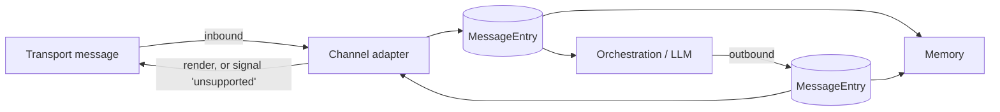
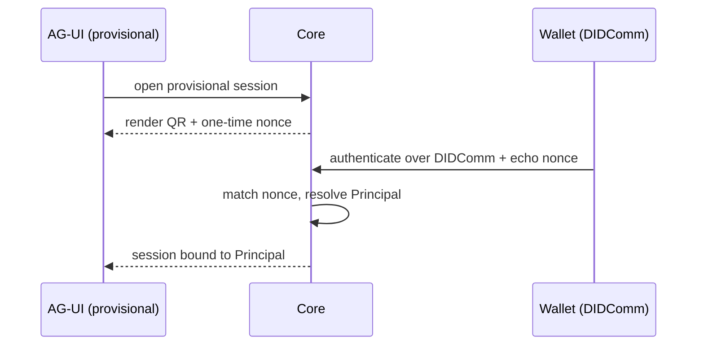
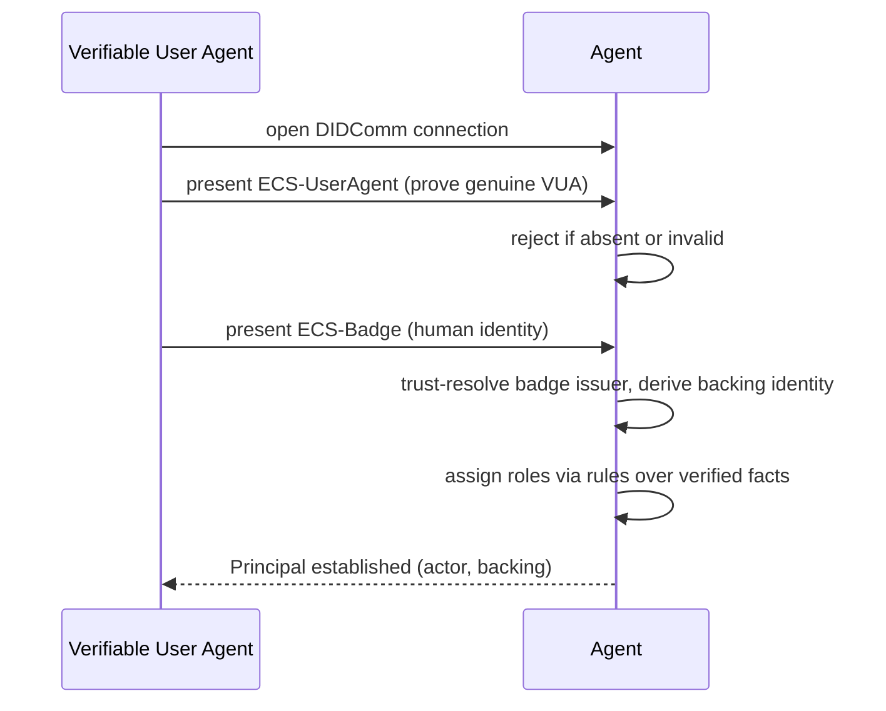
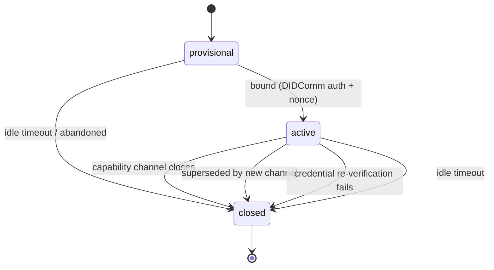
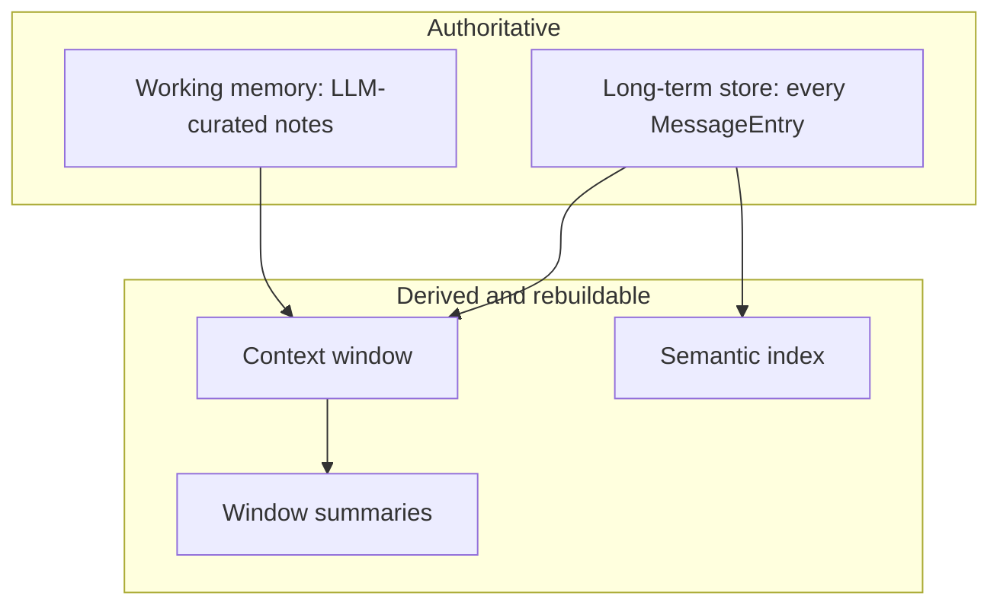
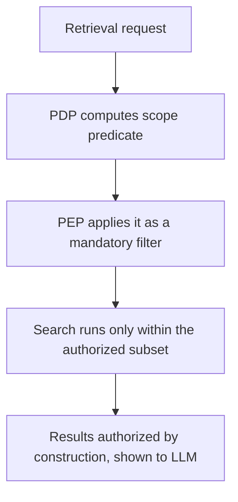
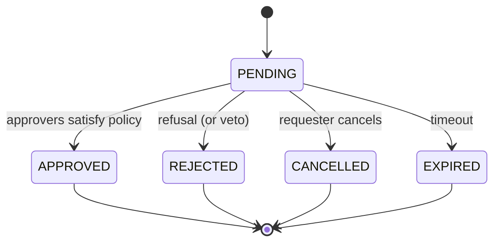
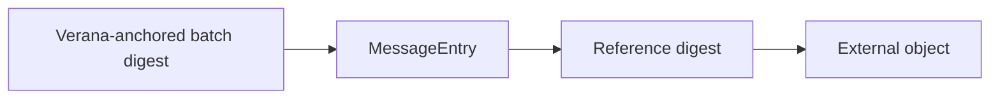

# Hologram AI Agent spec v2

## Product Positioning and Key Blocks

### Product positioning

The Hologram AI Agent is not the LLM itself.

It is a white-label personal agent and attestation wallet application that can be deployed by an organization, ecosystem operator, service provider, employer, institution, or individual-facing platform for its end users.

Each end user receives a personal verifiable agent interface combining:

- secure messaging;
- AI assistance;
- a wallet of attestations and verifiable credentials;
- policy-governed rights and capability presentation;
- trusted interaction with professional agents, organizational services, and third-party Verifiable Services.

The Hologram AI Agent enables a Principal to converse with other agents and services, selectively present attestations, prove rights or capabilities, request actions, receive challenges, obtain approvals, and execute trusted interactions under the policies defined by the agent-pack.

The LLM runtime performs reasoning and generation. It does not own identity, rights, credentials, memory, authorization, trust policies, business authority, retention, erasure, audit, or legal compliance decisions.

The Hologram AI Agent is the governed control layer that manages:

- Principal identity;
- attestation and credential presentation;
- conversation context;
- counterparty context;
- memory and retrieval;
- rights and delegation;
- tool access;
- business execution policies;
- human approvals;
- authentication challenges;
- audit evidence;
- privacy lifecycle;
- jurisdiction-specific compliance.

### Core product model

The core product model is:

- a white-label deployment operated by an organization, ecosystem, service provider, or platform;
- one personal Hologram experience per end user or Principal;
- secure messaging over DIDComm, AG-UI, and A2A;
- a capability channel for trust-bound operations;
- a wallet of attestations and verifiable credentials;
- selective disclosure of rights, roles, mandates, permissions, or capabilities;
- policy-governed execution of tools and third-party actions;
- auditable memory and action history;
- privacy-preserving data lifecycle;
- tamper-evident proof without making personal data immutable forever.

### Key Blocks

The main blocks are:

- Hologram AI Agent;
- User Front / Client UI;
- LLM Runtime;
- Principal;
- Actor Identity;
- Backing Identity;
- Attestation Wallet;
- Counterparty Agent / Verifiable Service;
- Conversation Session;
- Capability Channel;
- Long-term Store;
- Working Memory;
- Context Window;
- Semantic Index;
- Policy Engine;
- Tools / MCP;
- External Business Actors;
- Audit and Evidence Layer;
- Verana Ledger Anchoring.

### Terminology note

In this specification, unless explicitly stated otherwise, “Agent” means the Hologram AI Agent: the governed control layer acting as a Verifiable Service.

It does not mean:

- the LLM runtime;
- the user-facing front-end;
- a generic chatbot;
- a third-party AI agent;
- the human user;
- a single model invocation.

### Note on the User Front block

A User Front is an interaction interface. It does not itself hold business authority.

Business rights are attached to the Principal, its verified credentials, its backing identity, and the role / delegation policy defined in the agent-pack.

For an organization, multiple users may interact through different fronts while the Hologram AI Agent enforces the organization’s rights, delegation rules, jurisdiction profile, and compliance policies.

## Features

### Core & runtime

- Channel-agnostic core: all logic runs on Principals, Sessions, MessageEntries, and capability events — never on a specific transport.
- Ingestion pipeline (inbound): every inbound message is normalized to one typed canonical `MessageEntry` (classified + digested) before memory or LLM.
- Egress pipeline (outbound): every reply, capability event, and generated artifact is emitted as a canonical `MessageEntry`, persisted to memory (text-first), then rendered per-channel in its own idiom (or the channel declares it cannot) — no memory-bypassing outbound.
- Agent-pack manifest: prompts, languages, flows, tools, MCP, RAG, memory, and integrations in one `agent-pack.yaml`, with `${ENV}` overrides and schema validation.
- System-prompt add-on: versioned, feature-gated contract injected into the prompt so the LLM knows the platform's capabilities.
- Independent schema versioning (memory, agent-pack, prompt add-on) with migrations.

### Channels & transports

- Adapters for DIDComm, AG-UI, and A2A.
- Capability router: routes trust-bound actions (auth, credential exchange, sensors) to a channel that supports them.
- Bootstrap & binding: DIDComm-first or channel-first (QR + one-time nonce) linking of a transport to a Principal.
- Per-action capability profiles with explicit fallback (default: fail).

### Identity, trust & sessions

- Built on the Verifiable Trust spec v4: every peer — Verifiable Services (including this agent) and Verifiable User Agents — MUST comply; trust resolution, ECS credentials, and Proof-of-Trust follow that spec, and non-compliant peers are refused.
- Agent's own verifiable identity: a resolvable DID, itself a Verifiable Service (`verifiable-service`) presenting its own ECS-Service + ECS-Org/Persona; counterparties trust-resolve the agent too (mutual trust, no client/server distinction). Its DID anchors the DIDComm capability channel.
- Two-axis identity: actor (who acts) + backing (organization/credential behind them).
- Symmetric resolution: services via ECS-Service + Org/Persona; humans via ECS-Badge, trust-resolved through the issuer chain.
- Verifiable User Agent gate: on DIDComm connect, a `verifiable-user-agent` must present an ECS-UserAgent credential (AnonCreds, unlinkable) proving the wallet/app is a genuine VUA before anything else; non-verifiable peers are rejected. The human's identity then comes from the ECS-Badge.
- ECS-Badge provides identity + informative attributes only — never authorization.
- Role assignment from rules over verified facts (agent-pack `roleRules`).
- Verifiable-credential auth over DIDComm; credential liveness via TTL revalidation + idle timeout (re-checks issuer chain and revocation).
- Single deployment, federation-aware: own Org/Persona (home identity) is configuration; recognizes — but never hosts — partner backing identities.
- Session lifecycle with four termination triggers (channel close, channel supersede, credential failure, idle timeout); an unbound session has zero access.

### Memory

- Canonical `MessageEntry` with typed `sourceType` (text, voice, media, tool-call, approval, refusal, auth-challenge, reaction, state-update).
- Text-first: attachments stored as transcription / description / reference, never raw binary.
- Authoritative tiers: long-term store + LLM-curated working memory; derived: context window, semantic index, summaries.
- Token-based context window; pgvector semantic index with hybrid (keyword + vector) retrieval.
- RAG over documents (local + remote URLs, chunking) with pluggable vector store.

### Privacy & data lifecycle (GDPR)

- Every entry tagged on three axes: visibility, lifecycle state, purpose.
- Authorize-before-retrieve: all reads pass through one policy check; no global search.
- Purpose-bound elevation: cross-purpose access needs a declared purpose + human approval, time-boxed.
- Crypto-erasure with lineage cascade: per-entry keys; erasure cascades to derivatives while the audit chain is preserved.
- Retention defaults, legal hold, data minimization, and a memory-access audit log.

### Governance, jurisdiction & compliance

- Jurisdiction profile: every agent-pack declares applicable jurisdictions, regulations, sector rules, data-residency constraints, transfer restrictions, legal role mapping, and AI governance requirements.
- Context separation: conversation context, principal context, counterparty context, capability context, governance context, and LLM runtime context are distinct and governed separately.
- Policy engine: authorization, retrieval, tool execution, credential presentation, approvals, auth challenges, erasure, retention, and ledger anchoring are decided by deterministic policy, not by the LLM.
- Legal role mapping: deployments declare data-controller / processor roles and AI Act provider / deployer roles for the operator, platform, model providers, tool providers, credential issuers, and relying parties.
- AI Act readiness: deployments can declare AI risk classification, human oversight, event logging, model/prompt/tool versioning, technical documentation, monitoring, and incident traceability.

### Access control (RBAC)

- Per-role tool access: ALLOW / DENY / APPROVAL / REQUESTABLE.
- Role × visibility matrix for cross-session reads; auditor role; admin bypass.
- Tools filtered per user — the LLM only sees what the role permits.

### Tools & integrations

- MCP client: connect remote servers (stdio / SSE / streamable-http) and expose their tools.
- Per-user MCP credentials via in-chat config flow, encrypted (AES-256-GCM); lazy connect + tool discovery.
- Access modes: admin-controlled (shared token) or user-controlled (per-user token).
- HTTP tools from config; bundled tools (e.g. statistics); VS Agent + PostgreSQL integrations.

### Interaction

- Personalized welcome; state-aware contextual menus with badges; multi-language.
- Approval workflow: count / percentage / veto policies, notifications, menu badges, expiry, self-approval.
- Reaction intelligence: per-message reaction policy (notify / historize / conditional).
- Message-state updates (created / submitted / received / viewed / deleted).
- Auth challenges: biometric / face-match (liveness) / NFC.
- Credential-presentation tool (revocation re-checked per use); principal preferences (saved + auto-loaded).

### Media & multimodal

- Image generation (e.g. DALL-E / gpt-image) → convert + thumbnail → object store (MinIO) → preview message; event-driven, non-blocking.
- Speech-to-text (Whisper, cloud or self-hosted) for voice notes; vision (image-to-text) injected into chat.
- Media stored by reference (bucket/key, presigned on demand); encryption key never enters LLM context.

### Models

- Provider-agnostic LLM + embeddings via three adapter tiers: native (OpenAI, Anthropic, Ollama), one OpenAI-compatible adapter (OpenRouter, LiteLLM, Mistral, Groq, …), and special-protocol (Azure OpenAI, Bedrock, Vertex).
- Text-only or multimodal models; gateways add cross-provider fallback and cost routing.

### Integrity

- SHA-256 reference digests over external objects; tamper-evident chain (anchor → message → reference → object).
- Best-effort async anchoring to the Verana ledger (never blocks).

### Platform

- Helm / Kubernetes deployment; Docker Compose for local infra (VS Agent, Redis, PostgreSQL, MinIO).
- Statistics: agent reads via a stats query API; events ingested through Redis Streams → aggregator → PostgreSQL (or direct HTTP-ingest → Postgres) — no message broker (JMS / ActiveMQ Artemis dropped).

## Specification

*This section is normative.*

This specification describes the target requirements for a governable, jurisdiction-aware, privacy-preserving, AI Act-ready Hologram AI Agent.

Not every requirement must be delivered in the same product phase. Delivery phases may prioritize a subset of requirements. However, the target model MUST remain explicit so that implementation choices do not contradict future GDPR, AI Act, security, audit, erasure, jurisdiction, or governance requirements.

This section is the complete, self-contained requirements for the Hologram AI Agent. It depends on no other document. Each requirement has a stable identifier `[AREA-TOPIC-NNN]`, states exactly one rule using **MUST / SHOULD / MAY** (RFC 2119 keywords), and carries a `Verify:` line giving an objective acceptance check. Each requirement is intended to become one GitHub issue. The subsections mirror the Features above. All terms in **bold** are defined in `### Definitions`. Identifiers are stable: once assigned, a number is never reused or renumbered.

### Definitions

#### Identity & trust

- **Agent** — this software: a **Verifiable Service** that holds conversations, keeps memory, and performs trust-bound actions on behalf of its operator.
- **DID** — Decentralized Identifier: a cryptographically verifiable, resolvable identifier for a party or service.
- **Verifiable Trust spec v4** — the external standard that defines how services and user agents prove identity, authorization, and governance context before connecting. Referenced as a dependency; its verification procedure is not redefined here.
- **Verifiable Service (VS)** — a service identified by a resolvable **DID** that complies with the Verifiable Trust spec and exposes a **Proof-of-Trust**. The agent is a VS.
- **Verifiable User Agent (VUA)** — end-user software (wallet / app / browser) that complies with the Verifiable Trust spec, verifies the peers it connects to, and refuses non-compliant peers.
- **ECS credential** — an Essential Credential Schema credential defined by an ecosystem. Four kinds are used here: ECS-Service, ECS-Org, ECS-Persona, ECS-UserAgent.
- **ECS-Service** — a credential identifying a service or agent (its **actor identity**).
- **ECS-Org / ECS-Persona** — credentials identifying the organization or persona that backs an actor (its **backing identity**).
- **ECS-Badge** — a credential held by a human, issued by a **Verifiable Service**, carrying the human's identity and informative attributes (e.g. `userName`, `photo`, optionally `title`, `department`). The issuer's backing identity is obtained by **trust-resolving** the issuer DID.
- **ECS-UserAgent** — a credential proving that a connecting user agent is a genuine **VUA**; presented as an unlinkable AnonCreds credential.
- **Proof-of-Trust** — the verification result a party derives from Verifiable Trust resolution and presents before a connection is accepted.
- **Trust-resolve** — to resolve a **DID** *and* verify the party's full credential trust chain — not a bare DID-document lookup.
- **Principal** — an authenticated party the agent interacts with (a human, a bot, or another service), modeled as the pair (**actor identity**, **backing identity**). It is durable; sessions and the capability channel attach to it.
- **Actor identity** — the specific actor behind a Principal: a service's ECS-Service, or a human's ECS-Badge subject.
- **Backing identity** — the Organization or Persona behind the actor. Org and Persona are peer kinds; either may back an actor. Two Principals may share a backing identity yet differ in actor.
- **Home / Partner / Unrecognized** — the relation of a Principal's backing identity to the agent: the agent's own (home), a configured partner, or neither (unrecognized).
- **Connection type** — `verifiable-service` (a resolvable DID presenting ECS-Service + ECS-Org/Persona) or `verifiable-user-agent` (a user agent, typically `did:peer:`, presenting ECS-UserAgent + ECS-Badge over DIDComm).
- **Relying party** — the agent's posture toward identity: it owns no user directory; it establishes identity from presented credentials and assigns **roles** from verified facts via configured rules.

#### Channels & sessions

- **Channel** — a transport adapter into the core. Three exist: DIDComm, AG-UI, A2A. Each converts transport messages ↔ **MessageEntry** and renders **capability events** (or declares it cannot).
- **DIDComm / AG-UI / A2A** — the three transports: a wallet-based secure messaging channel (DIDComm), a web/app UI channel (AG-UI), and an agent-to-agent channel (A2A).
- **Capability channel** — the channel used for trust-bound operations (authentication, credential exchange, auth challenges). Always DIDComm. One active per Principal.
- **Capability event** — a core-emitted request for a trust-bound action (authenticate, exchange a credential, run an auth challenge, request approval) that the **capability router** sends to a channel able to serve it.
- **Conversation session** — one thread of interaction on a channel (a `sessionId`). A Principal may hold several at once, each with its own history.
- **Binding** — linking a conversation session to a Principal by DIDComm authentication. An unbound (provisional) session has no Principal, no roles, and zero access.

#### Memory & data

- **MessageEntry** — the canonical, transport-independent unit of memory: one typed, classified record of a thing said or done.
- **sourceType** — the typed kind of a MessageEntry: `text`, `voice`, `media`, `tool-call`, `approval`, `refusal`, `auth-challenge`, `reaction`, `state-update`.
- **Attachment** — a non-text item on a MessageEntry, persisted as a text representation + an object reference + integrity material, never as raw bytes.
- **Object store** — external blob storage (e.g. S3 / MinIO) holding encrypted binaries, addressed by `bucket/key` and served via presigned URLs.
- **Long-term store** — the authoritative store holding every MessageEntry.
- **Working memory** — durable, LLM-curated, principal-scoped notes the LLM writes; authoritative; the principal cannot read or edit it.
- **Context window** — the token-bounded slice of recent entries supplied to the LLM each turn; derived and rebuilt each turn.
- **Semantic index** — vector **embeddings** of entries enabling similarity search; derived, rebuildable, and never anchored.
- **Embedding** — a numeric vector representation of text used for semantic search; treated as personal data.
- **RAG** — retrieval-augmented generation: answering using passages retrieved from configured documents.

#### Governance & privacy

- **Agent-pack** — the single configuration bundle defining the agent's behavior and policy.
- **System-prompt add-on** — platform-authored prompt text, separate from the persona prompt, telling the LLM which platform capabilities are enabled.
- **Role** — an RBAC permission set held by a Principal, assigned by the agent from verified facts; defines what the principal may do or see by default.
- **Purpose** — the declared reason a principal needs an access exception, chosen from a governance-defined list; human-declared and human-approved; recorded for audit.
- **Elevation** — temporarily granting an out-of-role tool after a declared **purpose** + justification is human-approved; the grant is purpose-scoped and time-boxed.
- **Visibility** — who may access an entry: `session-private`, `principal-private`, `organization-shared`, `partner-shared`, `public`. The org/partner tiers compare **backing identity**.
- **Lifecycle state** — an entry's legal/retention status: `active`, `archived`, `legal-hold`, `crypto-erased`, `deleted`.
- **Crypto-erasure** — making plaintext unrecoverable by destroying the entry's per-entry key while retaining ciphertext + digest for audit.
- **Digest** — a SHA-256 hash used for integrity, computed over external objects and over batches of entries.
- **Anchoring** — writing a batch **digest** to the Verana ledger to make history tamper-evident.
- **Approval** — a human-in-the-loop sign-off required before a sensitive action runs or an **elevation** is granted.
- **Auth challenge** — a system-enforced identity check (device biometric/PIN, face-match with liveness, or NFC document read) routed to DIDComm.

#### Product, context and compliance

- **Personal Hologram Agent** — the user-facing deployment of the Hologram AI Agent for one Principal, combining messaging, AI assistance, attestations, credentials, memory, approvals, and policy-governed capabilities.

- **White-label operator** — the organization, ecosystem, platform, service provider, employer, institution, or individual-facing entity deploying the Hologram AI Agent under its own brand, rules, policies, and jurisdiction profile.

- **End user** — the natural person or professional user interacting with a Personal Hologram Agent through a User Front or Verifiable User Agent.

- **Counterparty Agent** — another AI agent, service, Verifiable Service, professional agent, organizational service, or third-party actor with which the Hologram AI Agent interacts.

- **Attestation Wallet** — the set of credentials, attestations, proofs, mandates, permissions, role facts, and capability claims available to the Principal and selectively presentable to a counterparty.

- **Conversation context** — the state and history of one conversation session between a Principal and a counterparty or channel.

- **Principal context** — the durable state attached to a Principal, including identity, credentials, preferences, working memory, sessions, role assignments, and capability channel.

- **Counterparty context** — the verified identity, backing identity, trust status, role, relationship, jurisdiction, and policy-relevant attributes of the peer with which the agent is interacting.

- **Capability context** — the action-specific state describing what the Principal wants to prove, request, approve, sign, execute, delegate, or access.

- **Governance context** — the applicable policy state, including roles, jurisdiction profile, legal roles, data categories, lawful bases, retention policies, AI Act profile, approval rules, auth-challenge rules, and audit requirements.

- **LLM runtime context** — the transient prompt context sent to an LLM for one turn. It is derived, bounded, minimized, and rebuilt from authorized sources. It is not an authoritative store.

- **Jurisdiction profile** — the agent-pack configuration identifying applicable jurisdictions, regulations, sector rules, data residency constraints, transfer restrictions, legal role mapping, retention rules, and AI governance requirements.

- **Legal role mapping** — the configuration mapping parties involved in the deployment to legal and regulatory roles such as data controller, data processor, joint controller, AI Act provider, AI Act deployer, tool provider, model provider, credential issuer, relying party, and auditor.

- **Policy Engine** — the deterministic enforcement component that decides whether an action, retrieval, credential presentation, tool call, approval, auth challenge, erasure, retention, or ledger anchoring operation is allowed, denied, escalated, or blocked.

- **AI Governance Profile** — the deployment-specific profile describing the AI system’s intended purpose, risk classification, model/provider configuration, human oversight model, logging requirements, documentation requirements, monitoring requirements, and incident handling requirements.

### CORE — Core & runtime

*Scope:* how every message flows through the agent, in both directions, and how the agent loads and versions its configuration. The core handles only abstract objects — **Principal**, **Conversation session**, **MessageEntry**, and **capability events**. DIDComm, AG-UI, and A2A are interchangeable transport adapters.

#### CORE-MSG — Message pipeline

- **[CORE-MSG-001]** The agent core MUST process only Principal, Session, MessageEntry, and capability-event objects; no core component may contain code specific to a transport protocol (DIDComm, AG-UI, A2A).
  *Verify:* a transport adapter can be added or removed without changing any core component.
- **[CORE-MSG-002]** Each channel adapter MUST convert every inbound transport message into exactly one MessageEntry before it reaches memory or the language model.
  *Verify:* for any inbound message, exactly one MessageEntry exists before the first memory write or model call.
- **[CORE-MSG-003]** Every MessageEntry MUST have a `sourceType` whose value is one of: `text`, `voice`, `media`, `tool-call`, `approval`, `refusal`, `auth-challenge`, `reaction`, `state-update`.
  *Verify:* persisting a MessageEntry with a missing or out-of-list `sourceType` is rejected.
- **[CORE-MSG-004]** Every MessageEntry MUST carry a non-empty text representation, even when it also has attachments.
  *Verify:* persisting a MessageEntry whose text representation is empty is rejected.
- **[CORE-MSG-005]** When an inbound message contains media (image, audio, or file), the MessageEntry MUST store a text form of it (audio → transcription; image/file → textual description) plus a reference to the stored object; the raw bytes MUST NOT be stored in the MessageEntry.
  *Verify:* a stored media MessageEntry contains text + a reference and carries no binary payload.
- **[CORE-MSG-006]** Every outbound item the agent sends — a reply, a capability event, or a generated artifact — MUST be written as one MessageEntry at the moment it is dispatched to the channel.
  *Verify:* each delivered outbound item has a matching MessageEntry.
- **[CORE-MSG-007]** When the agent sends generated media, the MessageEntry MUST store the generating prompt, a textual description, an object reference, and a SHA-256 digest of the object; the binary MUST NOT be stored in the MessageEntry.
  *Verify:* a stored generated-media MessageEntry contains prompt + description + reference + digest and no binary.
- **[CORE-MSG-008]** If a channel adapter cannot present a capability event on its transport, it MUST return an explicit `unsupported` result to the core and MUST NOT silently discard the event.
  *Verify:* sending an unsupported capability event to that adapter yields an `unsupported` signal, not a no-op.

#### CORE-PACK — Agent-pack manifest

- **[CORE-PACK-001]** The agent MUST load all behavior configuration from a single agent-pack manifest (persona prompt, language, tools, MCP servers, RAG sources, memory settings, role rules, recognized backing identities, purposes, approval and elevation policies, auth-challenge requirements, retention).
  *Verify:* with no agent-pack present, the agent refuses to start with a clear error.
- **[CORE-PACK-002]** The agent MUST allow any agent-pack value to be overridden via a documented `${ENV}` environment-variable substitution.
  *Verify:* setting the documented variable changes the effective value without editing the manifest.
- **[CORE-PACK-003]** The agent MUST validate the agent-pack against a published schema at startup and refuse to start on validation failure.
  *Verify:* a manifest with a wrong type or unknown required field is rejected with an error naming the field.
- **[CORE-PACK-004]** The agent-pack manifest MUST declare a schema version.
  *Verify:* a manifest missing the version, or declaring an unsupported version, is rejected.

- **[CORE-PACK-005]** The agent-pack manifest MUST declare governance configuration, including jurisdiction profiles, legal role mapping, AI governance profiles, data categories, lawful bases, retention policies, transfer policies, and policy-engine rules.
  *Verify:* an agent-pack missing mandatory governance configuration is rejected or explicitly marked as non-governed.
- **[CORE-PACK-006]** The agent-pack manifest MUST support multiple deployment contexts, each with its own operator, jurisdiction profile, legal role mapping, AI governance profile, and policy set.
  *Verify:* the same agent-pack can define at least two deployment contexts with different jurisdiction and retention rules.
- **[CORE-PACK-007]** The agent-pack manifest MUST declare whether the deployment is intended for employees, individual consumers, professional users, public-sector users, healthcare users, financial-services users, or another configured population.
  *Verify:* the served user population is available to the Policy Engine and audit log.
- **[CORE-PACK-008]** The agent-pack manifest MUST declare whether the agent is allowed to interact with external Counterparty Agents and under which trust, credential, jurisdiction, and data-sharing rules.
  *Verify:* a counterparty interaction without a permitted counterparty policy is denied by default.

#### CORE-PROMPT — System-prompt add-on

- **[CORE-PROMPT-001]** The agent MUST inject a platform-authored system-prompt add-on that is separate from the agent-pack persona prompt and never overrides it.
  *Verify:* changing the persona prompt leaves the add-on present; the add-on only appends.
- **[CORE-PROMPT-002]** The system-prompt add-on MUST describe only capabilities that are actually enabled in the current configuration.
  *Verify:* disabling a feature removes its text from the rendered add-on.
- **[CORE-PROMPT-003]** The system-prompt add-on MUST carry a version identifier independent of the agent-pack and memory schema versions.
  *Verify:* the add-on reports its own version; upgrading it does not require changing the agent-pack.
- **[CORE-PROMPT-004]** The system-prompt add-on SHOULD stay within a configured token budget (default target 500 tokens).
  *Verify:* the rendered add-on's token count is reported and the configured cap is enforced or warned.

#### CORE-VER — Schema versioning

- **[CORE-VER-001]** The memory schema, the agent-pack schema, and the system-prompt add-on MUST each be versioned independently.
  *Verify:* each of the three reports its own version number.
- **[CORE-VER-002]** The agent MUST provide a migration path for stored data whenever the memory schema version changes.
  *Verify:* data written under the previous memory schema version loads after upgrade with no manual edits.

### CHAN — Channels & transports

*Scope:* the three transport adapters, how trust-bound actions are routed to the channel that can serve them, how a transport gets bound to a **Principal**, and what each channel can and cannot render. Only DIDComm has a wallet, credential store, and device sensors, so trust-bound operations always run there.

#### CHAN-ADP — Adapters

- **[CHAN-ADP-001]** The agent MUST provide three channel adapters: DIDComm, AG-UI, and A2A.
  *Verify:* each of the three transports can carry a conversation end to end.
- **[CHAN-ADP-002]** Each channel adapter MUST expose only two responsibilities to the core: convert an inbound transport message into a MessageEntry, and render an outbound MessageEntry or capability event to its transport (or declare it cannot render it).
  *Verify:* an adapter exposes no core entry points beyond these conversion and rendering operations.
- **[CHAN-ADP-003]** The core MUST treat all three channels as equal for ordinary conversation; no channel is privileged as the conversation transport.
  *Verify:* a conversation runs fully over any single channel without special-casing.

#### CHAN-ROUTE — Capability routing

- **[CHAN-ROUTE-001]** The agent MUST route every trust-bound operation (authentication, credential exchange, auth challenge) to the Principal's DIDComm capability channel, regardless of which channel carries the conversation.
  *Verify:* a credential exchange triggered from an AG-UI conversation is served over DIDComm.
- **[CHAN-ROUTE-002]** The agent MUST allow a Principal to hold one capability channel (DIDComm) together with one or more conversation sessions on any channel.
  *Verify:* a Principal with an AG-UI conversation and a DIDComm capability channel is a single Principal.
- **[CHAN-ROUTE-003]** DIDComm MUST be eligible to carry ordinary conversation, not only trust-bound operations.
  *Verify:* a DIDComm-only deployment conducts a full conversation over DIDComm.
- **[CHAN-ROUTE-004]** When the core emits a capability event, the capability router MUST select a bound channel whose profile supports it and route the event there.
  *Verify:* each capability event is delivered only to a channel that declares support for it.
- **[CHAN-ROUTE-005]** An auth challenge MUST carry the `originSessionId` of the conversation session that triggered it, and its result MUST return only to that session.
  *Verify:* a challenge triggered by session A returns its result to session A and to no other session of the Principal.

#### CHAN-BIND — Bootstrap & binding

- **[CHAN-BIND-001]** The agent MUST support DIDComm-first bootstrap: authenticate over DIDComm, resolve the Principal, then open a conversation channel bound to that Principal.
  *Verify:* a session opened after DIDComm authentication is bound to the resolved Principal.
- **[CHAN-BIND-002]** The agent MUST support channel-first binding: open a provisional unbound session, then bind it to a Principal via a DIDComm authentication.
  *Verify:* a cross-device AG-UI session becomes bound after the wallet authenticates over DIDComm.
- **[CHAN-BIND-003]** For channel-first binding, the provisional session MUST generate a one-time nonce and the binding MUST succeed only when the wallet echoes that exact nonce over DIDComm.
  *Verify:* a binding attempt with a missing, wrong, or reused nonce is rejected.
- **[CHAN-BIND-004]** An unbound provisional session MUST have no Principal, no roles, and zero access to memory, tools, or cross-session data; it MUST be able only to advance its own binding.
  *Verify:* every memory or tool call from an unbound session is denied.
- **[CHAN-BIND-005]** Opening an additional AG-UI session while the Principal's DIDComm capability channel is already live MUST be satisfiable by a lightweight confirmation on the existing channel, without a full re-authentication.
  *Verify:* a second screen binds via a confirmation on the live channel rather than a new authentication.
- **[CHAN-BIND-006]** For A2A, the capability channel MUST be one-to-one with the conversation (one A2A session bound to one DIDComm channel, torn down together).
  *Verify:* closing an A2A session closes its paired DIDComm channel.
- **[CHAN-BIND-007]** For AG-UI, one DIDComm capability channel MUST be shared across all of a Principal's AG-UI sessions.
  *Verify:* two AG-UI screens of one Principal share a single DIDComm capability channel.

#### CHAN-PROF — Capability profiles & fallback

- **[CHAN-PROF-001]** Each channel adapter MUST declare a capability profile listing which capabilities it can render (e.g. text, rich menu, credential exchange, auth challenge, reaction, media reference).
  *Verify:* the core can query each adapter's declared profile.
- **[CHAN-PROF-002]** Credential exchange and auth challenges MUST be declared servable only by DIDComm.
  *Verify:* the AG-UI and A2A profiles report credential exchange and auth challenge as unsupported.
- **[CHAN-PROF-003]** When a required capability has no servable bound channel for the Principal, the agent MUST apply the per-action fallback policy, whose default MUST be `fail`.
  *Verify:* with no servable channel and no configured fallback, the action fails and is logged.
- **[CHAN-PROF-004]** The fallback policy MUST support an explicit `degrade` option that skips the action and logs the unmet requirement.
  *Verify:* configuring `degrade` causes the action to be skipped with a logged unmet-requirement record.

### IDENT — Identity, trust & sessions

*Scope:* how the agent proves its own identity, how it establishes the identity of every connecting peer under the Verifiable Trust spec v4, how it assigns roles from verified facts, and how it keeps credentials live and sessions correct over time.

#### IDENT-TRUST — Verifiable Trust baseline

- **[IDENT-TRUST-001]** Every peer the agent connects with — Verifiable Services and Verifiable User Agents — MUST comply with the Verifiable Trust spec v4, and the agent MUST refuse connections from non-compliant peers.
  *Verify:* a peer that fails Verifiable Trust verification is refused before any conversation.
- **[IDENT-TRUST-002]** The agent MUST trust-resolve a connecting peer (resolve its DID and verify its credential trust chain) before accepting the connection.
  *Verify:* a peer presenting an unverifiable credential chain is rejected.
- **[IDENT-TRUST-003]** Trust MUST be mutual: the agent MUST expose its own Proof-of-Trust and allow peers to trust-resolve it, with no client/server asymmetry.
  *Verify:* a peer can trust-resolve the agent and obtain its Proof-of-Trust.
- **[IDENT-TRUST-004]** The agent MUST consume the Verifiable Trust verification procedure as an external dependency and MUST NOT re-implement it.
  *Verify:* trust verification is delegated to the Verifiable Trust component, not duplicated in agent code.

#### IDENT-SELF — The agent's own identity

- **[IDENT-SELF-001]** The agent MUST have its own resolvable DID and operate as a Verifiable Service (connection type `verifiable-service`).
  *Verify:* the agent's DID resolves and exposes a valid Proof-of-Trust.
- **[IDENT-SELF-002]** The agent MUST present its own ECS-Service credential together with an ECS-Org or ECS-Persona credential identifying its backing identity.
  *Verify:* the agent's presented credentials include ECS-Service plus exactly one of ECS-Org or ECS-Persona.
- **[IDENT-SELF-003]** The agent's DID MUST be the anchor of its DIDComm capability channel.
  *Verify:* peers establish the DIDComm capability channel using the agent's DID.
- **[IDENT-SELF-004]** The agent's home backing identity (its Org or Persona) MUST be configuration, not hard-coded.
  *Verify:* changing the configured home backing identity changes the agent's presented backing identity with no code change.

#### IDENT-PRIN — Principal identity model

- **[IDENT-PRIN-001]** The agent MUST model every Principal as the pair (actor identity, backing identity).
  *Verify:* a stored Principal has an actor identity and either a backing identity or an explicit "no backing identity".
- **[IDENT-PRIN-002]** The agent MUST treat two Principals that share a backing identity but differ in actor identity as distinct Principals.
  *Verify:* two services of the same organization are distinct Principals with the same backing identity.
- **[IDENT-PRIN-003]** The agent MUST treat Organization and Persona backing identities as peer kinds and compare backing identity by a single equality regardless of kind.
  *Verify:* an org-backed and a persona-backed Principal are compared by the same equality check.
- **[IDENT-PRIN-004]** The Principal MUST be the durable identity to which sessions, the capability channel, working memory, preferences, and credentials attach; sessions and channels MUST be transient.
  *Verify:* closing all sessions leaves the Principal and its durable data intact.
- **[IDENT-PRIN-005]** The agent MUST resolve two sessions to the same Principal only when they resolve to the same (actor identity, backing identity) pair, never merely because they share a connection identifier.
  *Verify:* two sessions with the same connection id but different verified identities are not merged.

#### IDENT-RES — Identity resolution

- **[IDENT-RES-001]** For a `verifiable-service` peer, the agent MUST take the actor identity from the presented ECS-Service and the backing identity from the ECS-Org or ECS-Persona presented alongside it.
  *Verify:* a connecting service yields actor identity = ECS-Service and backing identity = the presented Org/Persona.
- **[IDENT-RES-002]** For a `verifiable-user-agent` (human) peer, the agent MUST take the actor identity from the presented ECS-Badge subject and obtain the backing identity by trust-resolving the badge issuer's DID to its ECS-Org/Persona.
  *Verify:* a connecting human yields actor identity = badge subject and backing identity = the issuer's trust-resolved Org/Persona.
- **[IDENT-RES-003]** On DIDComm connect, a `verifiable-user-agent` MUST present a valid ECS-UserAgent credential proving it is a genuine Verifiable User Agent before any identity exchange; the agent MUST reject the connection if it is absent or invalid.
  *Verify:* a user-agent connection without a valid ECS-UserAgent is rejected before identity exchange.
- **[IDENT-RES-004]** The agent MUST derive a human's backing identity only by trust-resolving the badge issuer (resolve plus verify the issuer's own ECS-Org/Persona chain), never by reading the issuer DID document alone.
  *Verify:* a badge whose issuer fails trust resolution yields no backing identity.
- **[IDENT-RES-005]** The agent MUST treat ECS-Badge attributes (e.g. `userName`, `photo`, `title`, `department`) as identity and informative facts only, never as role or authorization assertions.
  *Verify:* a badge stating a privileged title grants no role unless a configured rule maps it.
- **[IDENT-RES-006]** The agent MAY use the ECS-Badge `photo` attribute as the reference image for a face-match auth challenge.
  *Verify:* when configured, a face-match challenge compares the live capture against the badge photo.

#### IDENT-ROLE — Role assignment

- **[IDENT-ROLE-001]** The agent MUST act as a relying party: it MUST NOT host a user directory and MUST assign roles from verified credential facts, never from self-asserted roles.
  *Verify:* a peer that claims a role in its payload receives no role unless a rule assigns it.
- **[IDENT-ROLE-002]** The agent MUST assign roles by evaluating configured rules over verified facts (backing-identity relation plus selected claims), not by enumerating identities.
  *Verify:* changing a role rule changes assignments without listing individual identities.
- **[IDENT-ROLE-003]** A Principal whose backing identity is home MAY have its credential facts mapped directly to roles per configuration.
  *Verify:* a home-backed Principal receives the configured home role mapping.
- **[IDENT-ROLE-004]** A Principal whose backing identity is a recognized partner MUST default to a safe baseline role unless a rule elevates it on a verified claim.
  *Verify:* a partner-backed Principal with no elevating claim receives only the baseline role.
- **[IDENT-ROLE-005]** A Principal with a valid credential but an unrecognized backing identity MUST be authenticated with no backing identity and limited to public-scoped access.
  *Verify:* an unrecognized-but-valid Principal can access only `public` entries.
- **[IDENT-ROLE-006]** The agent MUST support optional per-actor role overrides for specific known actors.
  *Verify:* a configured per-actor override assigns the specified role to that actor only.
- **[IDENT-ROLE-007]** Recognition of a partner backing identity for visibility MUST be independent of role privilege.
  *Verify:* a recognized partner can match `partner-shared` visibility while holding only a baseline role.

#### IDENT-LIVE — Credential liveness

- **[IDENT-LIVE-001]** Each active session MUST be backed by a credential whose continued validity the agent enforces.
  *Verify:* a session whose backing credential cannot be validated is terminated.
- **[IDENT-LIVE-002]** On session activity, if the cached credential validity is older than the configured interval N, the agent MUST re-verify the credential (revocation check plus re-walk of the issuer trust chain) before proceeding.
  *Verify:* after N seconds, the next action triggers a fresh revocation and chain check.
- **[IDENT-LIVE-003]** The agent MUST perform at most one liveness re-verification per N seconds per session.
  *Verify:* multiple actions within N seconds trigger only one re-verification.
- **[IDENT-LIVE-004]** If re-verification shows the credential is revoked, expired, or its issuer is no longer trustable, the agent MUST terminate the affected session and require re-presentation.
  *Verify:* revoking a credential terminates its session on next activity.
- **[IDENT-LIVE-005]** If the failing credential is the Principal's identity credential, the agent MUST terminate all of that Principal's sessions.
  *Verify:* revoking the identity credential closes every session of that Principal.
- **[IDENT-LIVE-006]** The agent MUST apply an independent idle-session timeout that closes sessions with no activity beyond the configured idle limit.
  *Verify:* a session idle beyond the limit is closed.
- **[IDENT-LIVE-007]** The liveness mechanism MUST be uniform for humans (ECS-Badge plus issuer chain) and services (ECS-Service plus backing identity).
  *Verify:* human and service sessions undergo the same revalidation logic.
- **[IDENT-LIVE-008]** The agent MUST NOT track credential reissuance; it MUST validate only the credential presented to it.
  *Verify:* a reissued credential affects the agent only when the holder next presents it.
- **[IDENT-LIVE-009]** The interval N and the idle timeout MUST both be configurable.
  *Verify:* changing N or the idle timeout changes enforcement with no code change.

#### IDENT-SESS — Session lifecycle

- **[IDENT-SESS-001]** A conversation session MUST be in exactly one of the states `provisional`, `active`, or `closed`.
  *Verify:* a session's state is always exactly one of the three.
- **[IDENT-SESS-002]** When a DIDComm capability channel closes, the agent MUST close the AG-UI sessions that depend on it.
  *Verify:* closing the DIDComm channel closes its dependent AG-UI sessions.
- **[IDENT-SESS-003]** When a new DIDComm capability channel is established for a Principal that already has one, the agent MUST close the old channel and its dependent sessions.
  *Verify:* recovering on a new device closes the old channel's sessions.
- **[IDENT-SESS-004]** Opening a new conversation session that reuses an existing live capability channel MUST NOT be treated as a superseding new channel.
  *Verify:* opening a second tab does not close the first.
- **[IDENT-SESS-005]** A session MUST terminate when its underlying credential fails re-verification, and all of a Principal's sessions MUST terminate when its identity credential fails.
  *Verify:* credential failure terminates the correct scope of sessions.
- **[IDENT-SESS-006]** A session idle beyond the configured idle timeout MUST be closed and require re-authentication on return.
  *Verify:* an idle session is closed and the user must re-authenticate to resume.

#### IDENT-FED — Tenancy & federation-awareness

- **[IDENT-FED-001]** The agent MUST run as a single deployment; Organization and Persona MUST be configuration values, not infrastructure tenancy boundaries.
  *Verify:* the agent serves its configured org/persona with no per-tenant infrastructure.
- **[IDENT-FED-002]** The agent MUST resolve and distinguish the backing identity of every Principal (home or partner) so that `organization-shared` and `partner-shared` visibility can be enforced.
  *Verify:* each Principal's backing identity is recorded and comparable.
- **[IDENT-FED-003]** The agent MUST NOT host any partner's data or run any partner's tenant; it MUST only recognize partner identities.
  *Verify:* the deployment contains no partner-owned data store or tenant.

### GOV — Governance, context, jurisdiction and compliance

*Scope:* how the Hologram AI Agent is governed as a white-label personal agent and attestation wallet, how contexts are separated, how jurisdiction and legal roles are declared, and how deterministic policy enforces GDPR, AI Act, security, audit, and business rules before execution.

The LLM reasons.
The Policy Engine decides.
The audit layer proves.
The jurisdiction profile determines which rules apply.

The LLM MUST NOT be the authority for identity, access control, credential validity, purpose, lawful basis, jurisdiction, data retention, erasure, approval, auth challenge, ledger anchoring, or legal compliance.

#### GOV-PROD — Product and deployment model

- **[GOV-PROD-001]** The specification MUST treat the Hologram AI Agent as a white-label personal agent and attestation wallet application, not as a standalone LLM or generic chatbot.
  *Verify:* the agent-pack and runtime model distinguish the Hologram AI Agent from the LLM runtime and from the User Front.
- **[GOV-PROD-002]** A deployment MUST identify its white-label operator and the scope of end users or Principals it serves.
  *Verify:* an agent-pack without an operator identity and served-principal scope is rejected or explicitly marked as non-governed.
- **[GOV-PROD-003]** The agent MUST support interaction with Counterparty Agents and Verifiable Services while preserving the Principal’s context, credentials, and policy boundaries.
  *Verify:* a conversation with a counterparty records the counterparty identity, session, trust status, and applicable policies.
- **[GOV-PROD-004]** Credentials and attestations MUST be treated as wallet-held capabilities that may be selectively presented according to policy, counterparty, purpose, and user approval.
  *Verify:* a counterparty receives only the credential presentation explicitly selected and authorized for that context.

#### GOV-CTX — Context model

- **[GOV-CTX-001]** The agent MUST distinguish conversation context, principal context, counterparty context, capability context, governance context, and LLM runtime context.
  *Verify:* every retrieval, tool execution, credential presentation, approval, and auth challenge declares which context types it uses.
- **[GOV-CTX-002]** A conversation session MUST be scoped to one Principal and one conversation context, and SHOULD record the counterparty context when a counterparty is known.
  *Verify:* a session record identifies the Principal, channel, session id, and counterparty identity or records that no counterparty is bound.
- **[GOV-CTX-003]** The LLM runtime context MUST be a derived runtime view, rebuilt each turn from authorized entries, credential summaries, preferences, working memory, policies, and active session state.
  *Verify:* deleting the runtime context window loses no authoritative data and the next turn rebuilds it from authorized sources.
- **[GOV-CTX-004]** The agent MUST NOT retrieve entries from another session unless cross-session retrieval is authorized by role, visibility, lifecycle state, Principal identity, backing identity, purpose policy where applicable, and counterparty context.
  *Verify:* a test session cannot access another session’s entries unless all configured cross-session predicates are satisfied.
- **[GOV-CTX-005]** Context from one counterparty interaction MUST NOT be reused in another counterparty interaction unless policy explicitly allows it and the access is logged.
  *Verify:* data from a healthcare, HR, banking, or employer counterparty context is not injected into another counterparty context by default.

#### GOV-JUR — Jurisdiction profile

- **[GOV-JUR-001]** The agent-pack MUST declare a jurisdiction profile for each deployment or deployment context.
  *Verify:* an agent-pack without a jurisdiction profile is rejected or explicitly marked as non-governed.
- **[GOV-JUR-002]** A jurisdiction profile MUST identify the primary jurisdiction, applicable regulations, sector-specific rules, data-residency requirements, data-transfer restrictions, retention requirements, and audit constraints.
  *Verify:* the profile exposes all listed fields and validation rejects missing mandatory fields.
- **[GOV-JUR-003]** Every sensitive action MUST be evaluated against the active jurisdiction profile before execution.
  *Verify:* changing the jurisdiction profile changes the policy decision for at least one jurisdiction-sensitive test action.
- **[GOV-JUR-004]** The agent MUST support multiple deployment contexts with different jurisdiction profiles when the same Hologram AI Agent is deployed for multiple markets, sectors, operators, or user populations.
  *Verify:* two contexts can apply different retention, transfer, approval, and AI governance rules without code changes.

#### GOV-LEGAL — Legal role mapping

- **[GOV-LEGAL-001]** The agent-pack MUST define the legal role mapping for the operator, platform, model provider, tool provider, credential issuer, relying party, and auditor where applicable.
  *Verify:* every processing event can be attributed to configured legal roles.
- **[GOV-LEGAL-002]** The legal role mapping MUST support at least: `data_controller`, `data_processor`, `joint_controller`, `ai_act_provider`, `ai_act_deployer`, `model_provider`, `tool_provider`, `credential_issuer`, `relying_party`, and `auditor`.
  *Verify:* validation accepts these role values and rejects unknown mandatory role values.
- **[GOV-LEGAL-003]** The agent MUST record which party is acting as controller or processor for each personal-data processing context.
  *Verify:* a personal-data processing event without controller/processor attribution is rejected or marked incomplete for compliance.
- **[GOV-LEGAL-004]** The agent MUST record whether the white-label operator acts as AI Act deployer, AI Act provider, or both for each deployment context.
  *Verify:* the AI governance profile exposes provider/deployer role attribution.

#### GOV-POL — Policy Engine

- **[GOV-POL-001]** The agent MUST include a deterministic Policy Engine that evaluates retrieval, credential presentation, tool access, approvals, auth challenges, erasure, retention, and ledger anchoring before execution.
  *Verify:* each governed operation calls the Policy Engine before execution.
- **[GOV-POL-002]** The LLM MUST NOT be able to override or self-declare policy decisions.
  *Verify:* policy decisions are absent from the prompt and enforced outside the model response.
- **[GOV-POL-003]** The Policy Engine MUST return an explicit decision of `allow`, `deny`, `approval_required`, `auth_challenge_required`, `elevation_required`, `redact`, `degrade`, or `block`.
  *Verify:* each governed operation receives and logs exactly one policy decision.
- **[GOV-POL-004]** Every Policy Engine decision MUST be logged with the Principal, role, session, counterparty context, jurisdiction profile, data category, purpose, action type, decision, and timestamp.
  *Verify:* each policy decision produces a complete audit record.
- **[GOV-POL-005]** Policy evaluation MUST fail closed by default when required context, jurisdiction, credential, role, or legal metadata is missing.
  *Verify:* removing mandatory governance metadata causes sensitive actions to be denied or blocked.

### MEM — Memory

*Scope:* the canonical memory unit, how attachments are stored text-first, the authoritative vs. derived memory tiers, how the context window and retrieval work, and retrieval-augmented generation over documents.

The agent MUST maintain a data classification and lifecycle matrix for all memory-related objects.

##### Authoritative data

| Data object | Purpose | Persistence | Export / erasure | Sent to LLM |
|---|---|---|---|---|
| `MessageEntry` | Canonical record of anything said or done | Persistent | Exportable and erasable, subject to lifecycle rules | Yes, if selected |
| Long-term store | Source of truth for conversation and action history | Persistent | Exportable and erasable | No direct; entries may be selected |
| Working memory | LLM-curated notes influencing future context | To be explicitly defined | To be explicitly defined | Yes, if selected |
| Tool-call arguments | Inputs sent to external tools | Persistent | Exportable and erasable subject to audit policy | May be shown to LLM if needed |
| Tool-call results | Outputs returned by external tools | Persistent | Exportable and erasable subject to audit policy | Yes, if needed |
| Approval records | Human approval, refusal or elevation decision | Persistent | Exportable; erasure subject to audit policy | Usually no |

##### Derived or rebuildable data

| Data object | Purpose | Persistence | Export / erasure | Sent to LLM |
|---|---|---|---|---|
| Context window | Token-bounded prompt context sent to the model | Volatile / rebuilt each turn | Not directly exportable; source objects are exportable | Yes |
| Semantic index / embeddings | Similarity search and retrieval | Persistent but rebuildable | Treated as personal data; hard-delete on erasure | No |
| Window summaries | Temporary compression of context | Transient | Regenerated after source erasure | Yes, if included |
| RAG chunks | Searchable document passages | Persistent while source is active | Exportable if source-backed; erasable with source | Yes, if retrieved |
| LLM request payload | Prompt, selected context and allowed tools | Usually transient | Exportable only if logged; erasable by retention policy | N/A |
| LLM response payload | Model output before persistence | Transient until converted to `MessageEntry` | Exportable once persisted as `MessageEntry` | N/A |

##### Secret or external objects

| Data object | Purpose | Persistence | Export / erasure | Sent to LLM |
|---|---|---|---|---|
| Object store binary | Encrypted raw media / file object | Persistent while referenced | Exportable if in scope; erasable unless legal hold | No |
| Credential summary | Minimal record of credential presentation | Persistent according to policy | Exportable and erasable | Summary only if needed |
| MCP / tool credentials | Encrypted credentials used for tool execution | Persistent while active | No clear export by default; revocable / destroyable | No |

##### Requirements

- `[MEM-DATA-001]` The agent MUST maintain a documented data classification matrix covering all memory-related objects.
- `[MEM-DATA-002]` Any object that can contain personal data, inferred preferences, behavioral patterns or user-specific conclusions MUST be covered by export and erasure rules, even if it is derived or not directly editable by the Principal.
- `[MEM-DATA-003]` Any object sent to an external LLM provider MUST be traceable to its source objects and governed by the provider policy.

#### MEM-ENTRY — The memory unit

- **[MEM-ENTRY-001]** Each MessageEntry MUST carry: role (`principal`, `agent`, or `system`), a text representation, typed attachments, a `sourceType`, a language tag, a visibility, a lifecycle state, a purpose tag, and an integrity digest.
  *Verify:* a stored MessageEntry exposes all of these fields.
- **[MEM-ENTRY-002]** Each MessageEntry MUST record the actual language of its content as a tag.
  *Verify:* an entry's language tag matches the language of its text.
- **[MEM-ENTRY-003]** The agent MUST order entries within a conversation by timestamp, using an asynchronously-produced artifact's initiation timestamp for its position.
  *Verify:* a slowly-generated image appears in transcript order by its initiation time, not its completion time.

#### MEM-ATT — Text-first attachments

- **[MEM-ATT-001]** The agent MUST NOT persist raw binaries or base64 blobs in a MessageEntry or working memory; an attachment MUST be stored as a text representation plus an object reference plus integrity material.
  *Verify:* no memory record contains a binary or base64 payload.
- **[MEM-ATT-002]** For a voice attachment, the agent MUST store the speech-to-text transcription as the text representation and set `sourceType` to `voice`.
  *Verify:* a voice note yields an entry with a transcription and `sourceType` `voice`.
- **[MEM-ATT-003]** For an image attachment, the agent MUST store a textual description as the text representation, computed once and reused on later references.
  *Verify:* an image description is generated once; subsequent references do not recompute it.
- **[MEM-ATT-004]** For each stored object, the agent MUST persist the object-store reference (`bucket/key`), a SHA-256 digest of the encrypted object, and either a KMS/Vault/HSM key reference or a wrapped data-encryption key; raw encryption keys MUST NOT be stored in PostgreSQL or object metadata.
  *Verify:* a media attachment record contains a reference, a digest, and a key reference or wrapped key, but no raw AES key.
- **[MEM-ATT-005]** The agent MUST generate presigned URLs on demand for stored objects and MUST NOT persist the URLs.
  *Verify:* object access uses a freshly generated presigned URL, not a stored one.
- **[MEM-ATT-006]** Object decryption keys MUST be protected by a KMS, Vault, HSM, or equivalent key-management mechanism, and MUST NOT be placed in the LLM context, logs, prompts, MessageEntries, working memory, or unencrypted metadata.
  *Verify:* database inspection and prompt traces show no raw decryption key, and authorized decryption requires the configured key-management component.
- **[MEM-ATT-007]** For a credential presentation, the agent MUST store a summary (credential id, type, issuer DID, digest) and MUST NOT store the full presentation document in memory.
  *Verify:* a credential-presentation entry contains a summary and digest, not the full presentation.

#### MEM-TIER — Memory tiers

- **[MEM-TIER-001]** The agent MUST maintain exactly two authoritative memory stores: the long-term store (every MessageEntry) and working memory (LLM-curated notes).
  *Verify:* the only sources of truth are the long-term store and working memory.
- **[MEM-TIER-002]** The agent MUST treat the context window, the semantic index, and window summaries as derived and rebuildable from the authoritative stores.
  *Verify:* discarding and rebuilding any derived store reproduces it from authoritative data.
- **[MEM-TIER-003]** Working memory MUST be writable only by the LLM or authorized system processes, but working-memory entries that contain personal data, inferred preferences, behavioral patterns, or user-specific conclusions MUST be covered by controlled access, explanation, correction, export, restriction, and erasure workflows.
  *Verify:* a Principal cannot directly edit internal working-memory records, but can trigger a privacy workflow that exports, explains, corrects, restricts, or erases personal-data-bearing working-memory entries according to policy.
- **[MEM-TIER-004]** Window summaries MUST be transient compressions of the active window only and MUST NOT be persisted as independent authoritative records.
  *Verify:* a window summary is regenerated on demand and is not stored as a standalone record.
- **[MEM-TIER-005]** Working memory MUST be durable and authoritative while summarization MUST be mechanical and discardable.
  *Verify:* clearing all summaries loses no authoritative data.

#### MEM-RET — Window & retrieval

- **[MEM-RET-001]** The active context window MUST be bounded by a token budget, not by a message count.
  *Verify:* the window holds as many recent entries as fit the token budget, regardless of count.
- **[MEM-RET-002]** The semantic index MUST use vector embeddings (not substring matching) for similarity retrieval.
  *Verify:* semantically similar but lexically different entries are retrievable.
- **[MEM-RET-003]** Retrieval MUST be hybrid: short stored descriptions provide ambient context and vector search provides depth; long text MUST be chunked for embedding and retrieval.
  *Verify:* a long document is chunked, and retrieval returns relevant chunks alongside ambient descriptions.
- **[MEM-RET-004]** All retrieval MUST run within an already-authorized subset; there MUST be no global semantic search across unauthorized data.
  *Verify:* a vector search never returns an entry outside the caller's authorized scope.
- **[MEM-RET-005]** The window size and summary-trigger thresholds MUST be configurable.
  *Verify:* changing the window or summary settings changes behavior with no code change.

#### MEM-RAG — Retrieval-augmented generation

- **[MEM-RAG-001]** The agent MUST support RAG over configured documents from both local files and remote URLs.
  *Verify:* a configured local file and a configured URL are both usable as RAG sources.
- **[MEM-RAG-002]** The agent MUST chunk RAG documents for embedding and retrieval.
  *Verify:* a large document is split into retrievable chunks.
- **[MEM-RAG-003]** The RAG vector store MUST be pluggable, not hard-wired to one vendor.
  *Verify:* switching the configured vector-store backend requires configuration only.
- **[MEM-RAG-004]** RAG retrieval MUST be exposed to the LLM as a tool the model can invoke.
  *Verify:* the model can call a RAG retrieval tool and receive document passages.

### PRIV — Privacy & data lifecycle (GDPR)

*Scope:* how every entry is classified, how access is authorized before any search, how purpose-based exceptions are granted, how data is erased and cascaded, and how retention, minimization, and audit are enforced.

#### PRIV-CLS — Classification

- **[PRIV-CLS-001]** Every memory entry MUST carry three independent classifications: a visibility, a lifecycle state, and a purpose tag.
  *Verify:* an entry missing any of the three is rejected.
- **[PRIV-CLS-002]** Visibility MUST be one of: `session-private`, `principal-private`, `organization-shared`, `partner-shared`, `public`.
  *Verify:* an entry with an out-of-list visibility is rejected.
- **[PRIV-CLS-003]** Lifecycle state MUST be one of: `active`, `archived`, `legal-hold`, `crypto-erased`, `deleted`.
  *Verify:* an entry with an out-of-list lifecycle state is rejected.
- **[PRIV-CLS-004]** Visibility and lifecycle state MUST be independent; any visibility MUST be combinable with any lifecycle state.
  *Verify:* `organization-shared` + `legal-hold` and `principal-private` + `crypto-erased` are both representable.
- **[PRIV-CLS-005]** An `organization-shared` entry MUST be visible to Principals whose backing identity equals the agent's home backing identity; a `partner-shared` entry MUST be visible to Principals whose backing identity equals a recognized partner backing identity.
  *Verify:* org-shared is visible to home-backed Principals only; partner-shared is visible to the matching partner's Principals only.
- **[PRIV-CLS-006]** The org/partner visibility comparison MUST be a single equality on backing identity, applied identically whether the matched identity is home or a recognized partner.
  *Verify:* both tiers resolve through one equality-on-backing-identity code path.
- **[PRIV-CLS-007]** Every entry that may contain personal data MUST carry compliance metadata including data category, data-subject scope, lawful basis, processing purpose, retention policy, erasure eligibility, controller/processor attribution, jurisdiction profile id, and whether special-category data may be present.
  *Verify:* persisting a personal-data entry without complete compliance metadata is rejected.
- **[PRIV-CLS-008]** Data category MUST support at least: `non_personal`, `personal_data`, `special_category_data`, `credential_data`, `biometric_data`, `financial_data`, `health_data`, `employment_data`, `minor_data`, `system_security_data`, and `audit_metadata`.
  *Verify:* entries with unsupported data categories are rejected.
- **[PRIV-CLS-009]** Special-category data handling MUST be explicitly declared by policy and MUST default to `not_allowed` unless enabled for a specific deployment context, purpose, role, and jurisdiction profile.
  *Verify:* an entry classified as special-category data is rejected unless a policy explicitly allows it.
- **[PRIV-CLS-010]** Credential payloads, biometric captures, NFC document reads, face-match reference material, and auth-challenge evidence MUST be classified separately from ordinary conversation text.
  *Verify:* each such object is persisted with a specific data category and retention policy.
- **[PRIV-CLS-011]** Every entry MUST distinguish user-provided data, counterparty-provided data, system-generated data, LLM-generated data, inferred data, and derived data.
  *Verify:* an entry records its data origin and derived entries link back to source entries.
- **[PRIV-CLS-012]** The agent MUST mark whether an entry is allowed to be sent to an external LLM provider, and under which provider policy, jurisdiction profile, and minimization constraints.
  *Verify:* an entry disallowed for external LLM processing never appears in an external model request payload.

#### PRIV-SCOPE — Authorize before retrieval

- **[PRIV-SCOPE-001]** The agent MUST authorize the retrieval scope before searching: it MUST compute a scope predicate and apply it as a mandatory filter so only authorized entries enter the candidate set.
  *Verify:* unauthorized entries never appear in any candidate set, even before ranking.
- **[PRIV-SCOPE-002]** The agent MUST NOT search globally and then drop unauthorized results.
  *Verify:* no code path retrieves unauthorized rows and removes them afterwards.
- **[PRIV-SCOPE-003]** The scope predicate MUST be built in a single centralized query-builder that all retrieval routes through.
  *Verify:* every retrieval path calls the one query-builder; none bypasses it.
- **[PRIV-SCOPE-004]** The scope predicate MUST always require lifecycle state `active`.
  *Verify:* archived, crypto-erased, and deleted entries never appear in normal retrieval.
- **[PRIV-SCOPE-005]** Every dimension the predicate filters on (visibility, lifecycle state, backing identity, principal id, session id) MUST be an indexed, directly-decidable column, not computed at read time or buried in a blob.
  *Verify:* each predicate dimension maps to an indexed column.
- **[PRIV-SCOPE-006]** The purpose tag MUST NOT be a retrieval-predicate term; it is stored for audit only.
  *Verify:* retrieval results do not change when the purpose tag changes.
- **[PRIV-SCOPE-007]** The agent MUST write one memory-access log record per authorized retrieval, recording who and role, purpose, the scope predicate, matched entry ids, source sessions, whether results were shown to the LLM, whether they influenced a tool call, and a timestamp.
  *Verify:* each retrieval produces exactly one access-log record with these fields.

#### PRIV-ELEV — Purpose declaration & elevation

- **[PRIV-ELEV-001]** The agent MUST treat purpose as a human-declared, human-approved access exception; it MUST NOT be inferred by the system or the LLM.
  *Verify:* no purpose is ever set by the system or the model.
- **[PRIV-ELEV-002]** To use a normally-forbidden out-of-role tool, the principal MUST declare a purpose chosen from the agent-pack's governance-defined list plus a free-text justification.
  *Verify:* an elevation request without a listed purpose and a justification is rejected.
- **[PRIV-ELEV-003]** An elevation MUST require a human approver to accept it before the tool becomes reachable.
  *Verify:* the tool stays unreachable until a human approves.
- **[PRIV-ELEV-004]** On approval, the grant MUST be purpose-scoped and time-boxed and MUST expire automatically at the end of the window.
  *Verify:* the tool becomes unreachable again once the grant window elapses.
- **[PRIV-ELEV-005]** The LLM MAY detect an unmet need and draft an elevation request but MUST NOT declare the purpose or self-grant.
  *Verify:* a model-initiated elevation still requires human declaration and human approval.
- **[PRIV-ELEV-006]** Every use under an elevation grant MUST be logged with purpose, justification, approver identity, role, timestamp, and grant expiry.
  *Verify:* each elevated use produces a log record with these fields.
- **[PRIV-ELEV-007]** The agent MUST support an optional check that the declared purpose lies within a role's permitted-purposes set before elevation.
  *Verify:* with the check enabled, a purpose outside the role's permitted set is refused.

#### PRIV-ERASE — Crypto-erasure & lineage

- **[PRIV-ERASE-001]** Sensitive authoritative entries MUST be encrypted with a per-entry key, and the integrity digest MUST be computed over the ciphertext.
  *Verify:* an entry's digest verifies against its stored ciphertext.
- **[PRIV-ERASE-002]** On an accepted erasure request, the agent MUST destroy the entry's per-entry key, retain the ciphertext and digest anchor, and mark the entry `crypto-erased`.
  *Verify:* after erasure the plaintext is unrecoverable while the digest anchor still verifies.
- **[PRIV-ERASE-003]** Non-personal metadata (visibility, purpose, timestamps) MUST survive crypto-erasure for audit.
  *Verify:* an erased entry still reports its visibility, purpose, and timestamps.
- **[PRIV-ERASE-004]** An erasure request MUST be blocked when the entry's lifecycle state is `legal-hold`.
  *Verify:* erasing a legal-hold entry is refused.
- **[PRIV-ERASE-005]** Erasure MUST cascade along the lineage graph to derived artifacts: embeddings hard-deleted; working-memory notes citing the source flagged for revision; window summaries regenerated; tool-call arguments/results crypto-erased; approval records crypto-erased with audit metadata retained.
  *Verify:* after erasing a source, no derived artifact still exposes the erased plaintext.
- **[PRIV-ERASE-006]** Embeddings MUST be hard-deleted on erasure (not crypto-erased) and MUST remain outside the integrity/anchor chain.
  *Verify:* the semantic index is never anchored, and an erased entry's embedding is removed.

#### PRIV-RETN — Retention, minimization & lawful basis

- **[PRIV-RETN-001]** The agent MUST apply configurable retention defaults per data tier (session histories, media objects, credential presentations, digest anchors).
  *Verify:* entries past their tier's retention are transitioned according to policy.
- **[PRIV-RETN-002]** On retention expiry, session histories MUST be soft-deleted (archived), not hard-deleted, so the digest chain stays verifiable.
  *Verify:* an expired history is archived and excluded from active queries but remains re-hashable.
- **[PRIV-RETN-003]** Media objects referenced by any non-expired entry (including archived) MUST NOT be deleted; only truly orphaned objects MAY be garbage-collected.
  *Verify:* deleting an object still referenced by an archived entry is prevented.
- **[PRIV-RETN-004]** Retrieval MUST return the minimum data needed for the task, preferring summaries over raw entries where raw is not required.
  *Verify:* a task satisfied by a summary does not pull raw entries.
- **[PRIV-RETN-005]** Embeddings MUST be treated as personal data subject to the full lifecycle (classification, minimization, erasure).
  *Verify:* embeddings are scoped and erased like the entries they derive from.
- **[PRIV-RETN-006]** Each personal-data entry MUST carry an operator-asserted lawful basis supporting all GDPR Article 6 bases: `consent`, `contract`, `legal_obligation`, `vital_interests`, `public_task`, and `legitimate_interests`.
  *Verify:* an EU personal-data entry without a lawful basis, or with an unsupported lawful basis, is rejected.
- **[PRIV-RETN-007]** The agent MUST support a privacy export workflow covering MessageEntries, credential summaries, media references, tool-call arguments, tool-call results, approval records, working-memory-derived personal data, preferences, access logs, and derived personal-data artifacts where exportable.
  *Verify:* a Principal can request an export and receive all exportable personal-data-bearing objects linked to that Principal.
- **[PRIV-RETN-008]** The agent MUST support a rectification workflow for inaccurate personal data, including working-memory-derived conclusions and inferred preferences.
  *Verify:* a correction request updates or supersedes inaccurate personal-data-bearing records and records the correction event.
- **[PRIV-RETN-009]** The agent MUST support a restriction workflow that prevents selected personal-data-bearing entries from being used for retrieval, LLM context, tool execution, or credential presentation while preserving audit metadata.
  *Verify:* a restricted entry is excluded from normal retrieval and LLM context but remains visible to authorized audit flows.
- **[PRIV-RETN-010]** The agent MUST support an objection workflow where the Principal can object to processing under configured lawful bases, and the Policy Engine MUST decide whether processing continues, is restricted, or is stopped.
  *Verify:* an objection produces a policy decision and subsequent processing follows that decision.
- **[PRIV-RETN-011]** The agent MUST support a portability workflow for personal data that the operator determines to be portable under the applicable jurisdiction profile.
  *Verify:* portable data can be exported in a structured, commonly used, machine-readable format.
- **[PRIV-RETN-012]** Every data-subject-rights workflow MUST record the request, requester identity, scope, decision, legal basis for acceptance or refusal, timestamp, and resulting lifecycle actions.
  *Verify:* every access, rectification, erasure, restriction, portability, or objection request produces an auditable record.

### RBAC — Access control

*Scope:* how roles gate which tools a principal may use, how cross-session reads are governed, and how the LLM is shown only what the principal's role permits. Roles are fully configurable; the matrix below is illustrative.

| Role | `private` | `shared` | `global` | Scope |
| --- | --- | --- | --- | --- |
| `user` | own session only | read | read | own sessions |
| `partner` | none | read (own backing identity) | none | own backing-identity sessions |
| `operator` | none | read | read / write | all sessions |
| `admin` | read | read / write | read / write | all sessions |
| `auditor` | read (RO) | read (RO) | read (RO) | all data, no writes |

#### RBAC-TOOL — Tool-access tiers

- **[RBAC-TOOL-001]** Every (role, tool) pair MUST resolve to exactly one access tier: ALLOW, APPROVAL, REQUESTABLE, or DENY.
  *Verify:* each (role, tool) pair maps to exactly one of the four tiers.
- **[RBAC-TOOL-002]** An ALLOW tool MUST run directly for the role and MUST be visible to the LLM.
  *Verify:* an in-role ALLOW tool runs without approval and appears in the model's tool list.
- **[RBAC-TOOL-003]** An APPROVAL tool MUST run only after a per-use human approval.
  *Verify:* an APPROVAL tool does not execute until an approver accepts.
- **[RBAC-TOOL-004]** A REQUESTABLE tool MUST NOT be exposed to the LLM until requested, and MUST become reachable only via a purpose-declared, human-approved, time-boxed grant.
  *Verify:* a REQUESTABLE tool is absent from the model's tool list until an elevation grant is active.
- **[RBAC-TOOL-005]** A DENY tool MUST never be available, not even by request.
  *Verify:* a DENY tool can be neither invoked nor elevated.
- **[RBAC-TOOL-006]** A tool that is in no role's set and in no elevation policy MUST default to DENY.
  *Verify:* an unlisted tool is unreachable by every role.

#### RBAC-XSESS — Cross-session access

- **[RBAC-XSESS-001]** The agent MUST gate cross-session reads by a role × visibility matrix.
  *Verify:* a role's cross-session reads match the configured matrix.
- **[RBAC-XSESS-002]** The `auditor` role MUST have read-only access to all stored data including the audit log, and MUST NOT be able to write.
  *Verify:* an auditor reads everything and every write attempt is denied.
- **[RBAC-XSESS-003]** An audit/admin role with decryption privilege MUST be able to request media decryption only through an authorized audit flow using the configured KMS, Vault, HSM, or equivalent key-management mechanism; raw decryption keys MUST NOT be exposed to the auditor, admin, LLM, or application logs.
  *Verify:* an authorized auditor can decrypt a stored object through the audit flow, while raw keys remain inaccessible and every decryption request is logged.
- **[RBAC-XSESS-004]** `principal-private` cross-session reads MUST key on the full (actor identity, backing identity) pair; `organization-shared` and `partner-shared` MUST key on backing identity alone.
  *Verify:* a principal-private entry follows one actor across sessions, while org/partner entries are shared across all actors of the backing identity.
- **[RBAC-XSESS-005]** Role names, capabilities, and access policies MUST be fully configurable in the agent-pack, supporting unlimited custom roles.
  *Verify:* adding a custom role with a custom policy requires configuration only.

#### RBAC-FILTER — Per-principal tool filtering

- **[RBAC-FILTER-001]** The agent MUST present to the LLM only the tools permitted for the current principal's role plus any active elevation grants.
  *Verify:* the model's available tool list excludes tools the role cannot use.
- **[RBAC-FILTER-002]** Tool filtering MUST be enforced before the tool list reaches the model, not by instructing the model to avoid tools.
  *Verify:* a disallowed tool is absent from the model request payload, not merely discouraged in the prompt.

### TOOL — Tools & integrations

*Scope:* connecting to external tool servers over MCP, handling per-user tool credentials securely, and the agent's built-in tools and platform integrations.

#### TOOL-MCP — MCP client

- **[TOOL-MCP-001]** The agent MUST act as an MCP client able to connect to remote MCP servers over stdio, SSE, and streamable-HTTP transports.
  *Verify:* the agent connects to an MCP server over each of the three transports.
- **[TOOL-MCP-002]** The agent MUST discover a connected MCP server's tools and expose them to the LLM subject to RBAC.
  *Verify:* a connected server's tools appear to the model only when the role permits.
- **[TOOL-MCP-003]** The agent MUST connect to an MCP server lazily on first need, not eagerly at startup.
  *Verify:* an unused MCP server is not connected until one of its tools is needed.

#### TOOL-CRED — Tool credentials

- **[TOOL-CRED-001]** The agent MUST support two MCP access modes: admin-controlled (a shared token) and user-controlled (a per-user token).
  *Verify:* an admin-controlled server uses one shared token; a user-controlled server uses each user's own token.
- **[TOOL-CRED-002]** The agent MUST provide an in-chat configuration flow for a principal to supply their own MCP credentials.
  *Verify:* a principal can set an MCP credential through the conversation.
- **[TOOL-CRED-003]** Per-user MCP credentials MUST be stored encrypted with AES-256-GCM and MUST NOT be placed in the LLM context.
  *Verify:* stored MCP credentials are ciphertext and never appear in any prompt.
- **[TOOL-CRED-004]** With admin-controlled (shared-token) access, the agent's RBAC and elevation MUST be the security boundary for the wrapped system.
  *Verify:* with a shared token, out-of-role tool use is blocked by the agent's RBAC.

#### TOOL-HTTP — Built-in tools & integrations

- **[TOOL-HTTP-001]** The agent MUST support HTTP tools defined declaratively in the agent-pack (name, description, endpoint, method, parameters).
  *Verify:* a configured HTTP tool is callable by the model and reaches the configured endpoint.
- **[TOOL-HTTP-002]** The agent MUST provide bundled built-in tools (e.g. a statistics fetcher) that are enabled via configuration.
  *Verify:* enabling a bundled tool makes it available and disabling removes it.
- **[TOOL-HTTP-003]** The agent MUST integrate with the VS Agent for DIDComm messaging and credential operations.
  *Verify:* messages and credential exchanges flow through the VS Agent.
- **[TOOL-HTTP-004]** The agent MUST use PostgreSQL as its persistence backend for entries and policy state.
  *Verify:* stored entries and policy records are persisted in PostgreSQL.

### INTX — Interaction

*Scope:* how the agent greets and guides principals, runs the human-in-the-loop approval workflow, handles reactions and message states, enforces auth challenges, presents credentials, and remembers preferences.

#### INTX-MENU — Welcome & menus

- **[INTX-MENU-001]** The agent MUST present a personalized welcome to a principal on connection.
  *Verify:* a returning principal receives a personalized welcome.
- **[INTX-MENU-002]** The agent MUST present state-aware contextual menus whose items reflect the principal's current state and permitted actions.
  *Verify:* menu items change with the principal's state and role.
- **[INTX-MENU-003]** The agent MUST show menu badges (e.g. pending-approval counts) on relevant menu items.
  *Verify:* a pending approval increments the relevant menu badge.
- **[INTX-MENU-004]** The agent MUST support multiple presentation languages, with presentation language handled by the channel/frontend.
  *Verify:* the same conversation renders menus and flows in a configured presentation language.

#### INTX-APPR — Approval workflow

- **[INTX-APPR-001]** The agent MUST support two approval kinds through one mechanism: sensitivity approval (in-role, high-stakes, per-use) and elevation approval (out-of-role, purpose-declared).
  *Verify:* both an in-role sensitive tool and an out-of-role tool route through the approval workflow.
- **[INTX-APPR-002]** An approval policy MUST support a `count` policy (a single approver or N distinct approvers) and a `percentage` policy (e.g. majority or unanimous).
  *Verify:* configuring count or percentage changes how many approvals are required.
- **[INTX-APPR-003]** An approval policy MUST support an optional veto-on-refusal rule.
  *Verify:* with veto enabled, a single refusal blocks the action.
- **[INTX-APPR-004]** Eligible approvers MUST be those whose role grants approval rights for the tool, optionally restricted by connection type.
  *Verify:* only configured approver roles (and connection types) can approve.
- **[INTX-APPR-005]** If the requester already holds an approver role for the tool, the action MUST proceed by self-approval without a prompt.
  *Verify:* a requester who is also an approver runs the tool without an extra prompt.
- **[INTX-APPR-006]** The agent MUST notify eligible approvers, at minimum via a contextual menu item and badge.
  *Verify:* an eligible approver sees a notification for a pending request.
- **[INTX-APPR-007]** An approval request MUST follow the lifecycle PENDING → APPROVED / REJECTED / CANCELLED / EXPIRED and MUST become EXPIRED after its configured timeout.
  *Verify:* an unactioned request becomes EXPIRED at its timeout.
- **[INTX-APPR-008]** Every request, approval, and refusal MUST be persisted as a first-class entry (`sourceType` `approval` or `refusal`) carrying purpose, justification, approver identity, role, timestamp, and grant expiry.
  *Verify:* an approval or refusal entry records all of these fields.
- **[INTX-APPR-009]** The LLM MUST NOT declare the purpose or self-approve; it MAY only detect the need and draft the request.
  *Verify:* no approval is granted without a human action.

#### INTX-REACT — Reactions

- **[INTX-REACT-001]** The agent MUST let the LLM set a per-message reaction policy on each outgoing message (`notify`, `historize`, or a conditional rule by emoji).
  *Verify:* an outgoing message carries the model-chosen reaction policy.
- **[INTX-REACT-002]** The agent MUST record an inbound reaction as a MessageEntry with `sourceType` `reaction`.
  *Verify:* a received reaction yields a `reaction` entry.
- **[INTX-REACT-003]** Reaction handling MUST follow the per-message policy (notify vs. historize vs. conditional).
  *Verify:* a reaction matching a `notify` rule notifies; one matching `historize` is only recorded.

#### INTX-STATE — Message states

- **[INTX-STATE-001]** The agent MUST handle the message-state updates `created`, `submitted`, `received`, `viewed`, and `deleted` with a real handler, not a no-op.
  *Verify:* each state transition invokes the handler.
- **[INTX-STATE-002]** The agent MUST be able to record a message-state update as a MessageEntry with `sourceType` `state-update` where useful to the LLM.
  *Verify:* a "viewed" event can be recorded as a `state-update` entry.

#### INTX-AUTH — Auth challenges

- **[INTX-AUTH-001]** The agent MUST support the auth-challenge types: device authentication (biometric/PIN), face-match with liveness, and NFC document read.
  *Verify:* each challenge type can be requested.
- **[INTX-AUTH-002]** Auth-challenge requirements MUST be declared per action in the agent-pack and enforced by the system, not decided by the LLM.
  *Verify:* a configured action triggers its challenge regardless of the model.
- **[INTX-AUTH-003]** The LLM MUST be informed only of the challenge outcome and MUST adapt (abort on failure, proceed on success).
  *Verify:* the model receives a pass/fail result, not the challenge mechanics.
- **[INTX-AUTH-004]** Auth challenges MUST route to the Principal's DIDComm capability channel and carry `originSessionId` so the result returns to the initiating session.
  *Verify:* a challenge result returns to the session that triggered it.
- **[INTX-AUTH-005]** If no capability channel can serve a challenge, the agent MUST apply the per-action fallback (default `fail`, optional `degrade`).
  *Verify:* with no servable channel, the action fails by default or degrades if configured.
- **[INTX-AUTH-006]** Each auth-challenge outcome MUST be persisted as a MessageEntry with `sourceType` `auth-challenge` recording type, result, and timestamp.
  *Verify:* every challenge produces an `auth-challenge` entry.

#### INTX-CRED — Credential presentations

- **[INTX-CRED-001]** The agent MUST expose a tool that returns the Principal's credentials to the LLM.
  *Verify:* the model can list the principal's credentials via the tool.
- **[INTX-CRED-002]** The agent MUST re-check credential revocation on every privileged use of a credential, never relying on a prior verification.
  *Verify:* a credential revoked after issuance is rejected on its next privileged use.

#### INTX-PREF — Principal preferences

- **[INTX-PREF-001]** The agent MUST let the LLM persist discovered principal preferences (e.g. language, formatting, communication style) via a tool.
  *Verify:* a preference set during a conversation is stored.
- **[INTX-PREF-002]** Principal preferences MUST be durable across sessions, tied to Principal identity, and auto-loaded into context each turn.
  *Verify:* a preference persists across sessions and appears in later context automatically.

### MEDIA — Media & multimodal

*Scope:* generating media without blocking the conversation, turning inbound voice and images into text, and storing media safely. Storage rules common to all attachments are in `MEM-ATT`; this area covers the media-specific behavior.

#### MEDIA-GEN — Generation

- **[MEDIA-GEN-001]** Media generation (e.g. images) MUST be event-driven and non-blocking: the agent MUST respond promptly and generate in the background without blocking further input.
  *Verify:* the principal can keep chatting while an image is being generated.
- **[MEDIA-GEN-002]** A generated artifact MUST be persisted as a MessageEntry ordered by its initiation timestamp, so transcript order is preserved without holding input.
  *Verify:* a slowly-generated image appears in transcript order by its initiation time.
- **[MEDIA-GEN-003]** The agent MUST be able to expose a `generating` state to the LLM so it can answer status questions during generation.
  *Verify:* the model can report progress while a generation is in flight.
- **[MEDIA-GEN-004]** On image generation the agent MUST produce both a full image and a thumbnail, store both in the object store, and send a preview message.
  *Verify:* a generated image yields a stored full image, a stored thumbnail, and a preview message.

#### MEDIA-STT — Speech-to-text & vision

- **[MEDIA-STT-001]** The agent MUST transcribe an inbound voice note to text via speech-to-text before reasoning over it.
  *Verify:* a voice note is transcribed and the transcription is used by the model.
- **[MEDIA-STT-002]** The speech-to-text provider MUST be configurable to run against a cloud service or a self-hosted endpoint.
  *Verify:* switching the STT provider or endpoint is configuration only.
- **[MEDIA-STT-003]** The agent MUST support vision (image-to-text) so an inbound image's textual description is injected into the conversation.
  *Verify:* an inbound image yields a description available to the model.

#### MEDIA-REF — Storage

- **[MEDIA-REF-001]** All media objects MUST be stored in the object store encrypted at rest and addressed by `bucket/key`.
  *Verify:* a stored media object is encrypted and referenced by `bucket/key`.

### LLM — Models

*Scope:* keeping the agent provider-agnostic for both language models and embeddings, supporting text-only and multimodal models, and treating gateways as first-class.

#### LLM-PROV — Provider adapters

- **[LLM-PROV-001]** The agent MUST support LLM providers through three adapter tiers: native adapters (e.g. OpenAI, Anthropic, Ollama), a single OpenAI-compatible adapter, and special-protocol adapters.
  *Verify:* a provider from each tier can be configured and used.
- **[LLM-PROV-002]** Adding an OpenAI-wire-compatible provider or gateway (e.g. OpenRouter, LiteLLM, Mistral, Groq) MUST be configuration (base URL plus key), not code.
  *Verify:* a new OpenAI-compatible endpoint works by setting base URL and key only.
- **[LLM-PROV-003]** The agent MUST provide special-protocol adapters where the wire protocol differs from OpenAI (e.g. Azure OpenAI, AWS Bedrock, Google Vertex AI).
  *Verify:* at least one special-protocol provider works through its dedicated adapter.
- **[LLM-PROV-004]** The LLM provider and model MUST be selectable via configuration without code changes.
  *Verify:* switching provider or model is configuration only.

#### LLM-EMB — Embeddings

- **[LLM-EMB-001]** The embeddings provider MUST be pluggable (cloud or self-hosted) and MUST NOT be hard-wired to one vendor.
  *Verify:* switching the embeddings provider is configuration only.
- **[LLM-EMB-002]** The embeddings provider MUST be independent of the LLM provider; the two MAY differ.
  *Verify:* the agent runs with an embeddings provider different from its LLM provider.

#### LLM-MODE — Modalities & gateways

- **[LLM-MODE-001]** The agent MUST work with both text-only and multimodal models and MUST NOT depend on a model being multimodal.
  *Verify:* the agent functions on a text-only model because every entry has a text representation.
- **[LLM-MODE-002]** When a multimodal model is configured, the agent MAY additionally pass referenced media to it, but core behavior MUST NOT require it.
  *Verify:* disabling multimodal passing leaves the agent fully functional on text.
- **[LLM-MODE-003]** The agent MUST support gateway providers that add cross-provider fallback and cost/latency routing through the OpenAI-compatible tier.
  *Verify:* a configured gateway routes across providers per its policy.

### AIGOV — AI governance and EU AI Act readiness

*Scope:* how the agent records AI-system configuration, risk classification, human oversight, model/provider usage, prompt/tool versions, logging, documentation, monitoring, and incident traceability so that deployments can support EU AI Act governance where applicable.

This section does not classify every deployment as high-risk. It requires the agent to carry the metadata and controls needed to support risk-based classification and AI Act-ready operation when required by the deployment context.

#### AIGOV-PROF — AI Governance Profile

- **[AIGOV-PROF-001]** The agent-pack MUST declare an AI Governance Profile for each deployment context.
  *Verify:* a deployment context without an AI Governance Profile is rejected or explicitly marked as not assessed for AI governance.
- **[AIGOV-PROF-002]** The AI Governance Profile MUST declare intended purpose, served user population, deployment domain, operator role, AI Act provider/deployer attribution, model providers, tool providers, and whether high-risk assessment is required.
  *Verify:* all required profile fields are present and available to the Policy Engine and audit layer.
- **[AIGOV-PROF-003]** The AI Governance Profile MUST support risk classification values: `not_assessed`, `out_of_scope`, `minimal_risk`, `limited_risk`, `high_risk`, and `prohibited`.
  *Verify:* unsupported risk classification values are rejected.
- **[AIGOV-PROF-004]** If the AI Governance Profile is `high_risk`, the agent MUST enable high-risk operating controls for logging, human oversight, documentation, monitoring, and incident traceability.
  *Verify:* setting risk classification to `high_risk` enables the required controls and prevents startup if mandatory controls are missing.
- **[AIGOV-PROF-005]** If the AI Governance Profile is `prohibited`, the agent MUST refuse to operate in that deployment context.
  *Verify:* a prohibited deployment context cannot start or execute actions.

#### AIGOV-VERS — Model, prompt and tool versioning

- **[AIGOV-VERS-001]** Every LLM invocation MUST record the model provider, model identifier, model version where available, configuration parameters, prompt-add-on version, agent-pack version, enabled tool list, and retrieval scope id.
  *Verify:* each model call has a complete AI invocation record.
- **[AIGOV-VERS-002]** Every tool exposed to the LLM MUST have a versioned definition, including name, description, parameters, endpoint or MCP origin, access policy, data categories handled, and risk level.
  *Verify:* changing a tool definition changes its version and prior executions remain linked to the previous version.
- **[AIGOV-VERS-003]** Every system prompt, persona prompt, policy prompt add-on, and model instruction injected into the LLM request MUST be versioned and traceable.
  *Verify:* a generated answer can be traced back to the exact prompt components used.

#### AIGOV-LOG — AI event logging

- **[AIGOV-LOG-001]** The agent MUST maintain AI event logs for model calls, retrieval events, tool calls, policy decisions, approvals, refusals, auth challenges, credential presentations, and generated outputs.
  *Verify:* a complete timeline can be reconstructed for an AI-assisted action.
- **[AIGOV-LOG-002]** AI event logs MUST support traceability from final output back to source messages, retrieved entries, credentials, tool calls, policy decisions, model invocation, and human approvals.
  *Verify:* an auditor can reconstruct why a tool was executed or why an answer was produced.
- **[AIGOV-LOG-003]** AI event logs MUST be retained according to the AI Governance Profile, jurisdiction profile, and data lifecycle policies.
  *Verify:* log retention differs correctly across deployment contexts.

#### AIGOV-HUMAN — Human oversight

- **[AIGOV-HUMAN-001]** The agent MUST support human oversight controls for actions classified as sensitive, high-impact, high-risk, or requiring human validation under the AI Governance Profile.
  *Verify:* a high-risk action cannot execute without the configured oversight control.
- **[AIGOV-HUMAN-002]** Human oversight roles MUST be assigned to natural persons with configured competence, authority, and role eligibility.
  *Verify:* an approver lacking the required oversight role cannot approve the action.
- **[AIGOV-HUMAN-003]** The agent MUST allow authorized human overseers to approve, refuse, override, interrupt, or stop a governed action where configured.
  *Verify:* an overseer can stop or refuse a pending governed action and the refusal is enforced.

#### AIGOV-DOC — Documentation and instructions for use

- **[AIGOV-DOC-001]** The agent MUST be able to produce a deployment evidence package containing agent-pack version, AI Governance Profile, jurisdiction profile, legal role mapping, enabled models, enabled tools, data categories, retention policies, human oversight rules, and audit-log configuration.
  *Verify:* the evidence package can be generated for a deployment context.
- **[AIGOV-DOC-002]** The agent MUST expose instructions-for-use metadata for deployers, including intended purpose, limitations, required human oversight, prohibited uses, data input constraints, logging behavior, and incident escalation.
  *Verify:* instructions-for-use metadata is generated from the AI Governance Profile and agent-pack.

#### AIGOV-MON — Monitoring and incidents

- **[AIGOV-MON-001]** The agent MUST support runtime monitoring of policy denials, failed auth challenges, refused approvals, credential revocation failures, tool failures, anomalous tool usage, model/provider errors, and high-risk action outcomes.
  *Verify:* monitoring metrics are emitted for each listed event class.
- **[AIGOV-MON-002]** The agent MUST support incident records for events that may affect safety, fundamental rights, data protection, security, or compliance.
  *Verify:* an incident can be opened from a policy decision, tool failure, auth failure, data breach signal, or overseer report.
- **[AIGOV-MON-003]** Incident records MUST link to the relevant Principal, session, counterparty context, policy decision, tool call, model invocation, affected data categories, and remediation status.
  *Verify:* an incident can be traced back to all relevant runtime evidence.

### INTEG — Integrity

*Scope:* making historized data tamper-evident through reference digests and a verifiable chain anchored to the Verana ledger.

#### INTEG-DIG — Reference digests

- **[INTEG-DIG-001]** Every externally-referenced object (media object or stored credential) MUST carry a SHA-256 digest stored in the referencing entry.
  *Verify:* a referencing entry contains the digest of its external object.
- **[INTEG-DIG-002]** The integrity chain MUST link an anchored batch digest to the message, to its reference digest, to the external object, so that any modification breaks the chain.
  *Verify:* altering an external object or an entry makes chain verification fail.
- **[INTEG-DIG-003]** The semantic index (embeddings) MUST be excluded from the integrity chain.
  *Verify:* embeddings are never part of a verified digest chain.

#### INTEG-ANCHOR — Ledger anchoring

- **[INTEG-ANCHOR-001]** The agent MUST periodically compute a digest over a batch of persisted entries and anchor it to the Verana ledger.
  *Verify:* batches produce ledger-anchored digests on the configured cadence.
- **[INTEG-ANCHOR-002]** Anchoring MUST be asynchronous, best-effort, and retry-queued, and MUST NOT block the conversation.
  *Verify:* with the ledger unavailable, conversation continues and anchoring retries later.
- **[INTEG-ANCHOR-003]** The batch cadence MUST be configurable.
  *Verify:* changing the cadence changes anchoring frequency with no code change.
- **[INTEG-ANCHOR-004]** Local digest-anchor records MUST be retained indefinitely for later verification.
  *Verify:* anchor records remain available for audit regardless of other tiers' retention.
- **[INTEG-ANCHOR-005]** The Verana ledger MUST NOT store personal data, credential payloads, media content, conversation content, tool arguments, tool results, biometric material, auth-challenge evidence, or directly identifying information.
  *Verify:* ledger transactions contain only non-reversible digests, timestamps, and non-identifying verification metadata.
- **[INTEG-ANCHOR-006]** Ledger anchoring MUST preserve tamper-evidence without making personal data immutable forever.
  *Verify:* after crypto-erasure, the plaintext is unrecoverable while the digest verification path remains valid.
- **[INTEG-ANCHOR-007]** Batch digests anchored to the ledger MUST be computed over encrypted or canonicalized records in a way that does not require personal data to remain readable for future verification.
  *Verify:* a verifier can prove integrity without accessing personal-data plaintext.
- **[INTEG-ANCHOR-008]** Ledger metadata MUST be reviewed by the Policy Engine before anchoring to ensure that no personal data or linkable identifier is included.
  *Verify:* an attempted anchor containing prohibited metadata is rejected before ledger submission.

### PLAT — Platform

*Scope:* how the agent is deployed and how it collects and serves usage statistics without a message broker.

#### PLAT-DEPLOY — Deployment

- **[PLAT-DEPLOY-001]** The agent MUST be deployable to Kubernetes via a Helm chart.
  *Verify:* the Helm chart deploys a working agent.
- **[PLAT-DEPLOY-002]** The agent MUST provide a Docker Compose setup for local development infrastructure (VS Agent, Redis, PostgreSQL, and an object store such as MinIO).
  *Verify:* a single compose command brings up the agent and its dependencies locally.
- **[PLAT-DEPLOY-003]** All deployment-environment values MUST be configurable via environment variables.
  *Verify:* changing an environment variable reconfigures the deployment without rebuilding the image.

#### PLAT-STATS — Statistics

- **[PLAT-STATS-001]** The agent MUST read statistics via a stats query API (by time range, stat class, and granularity), not by querying a broker.
  *Verify:* a statistics query returns aggregated results from the query API.
- **[PLAT-STATS-002]** Statistics events MUST be ingested without a JMS or ActiveMQ message broker.
  *Verify:* no JMS/ActiveMQ broker exists in the statistics path.
- **[PLAT-STATS-003]** Statistics ingestion MUST use either Redis Streams (producer → consumer group → PostgreSQL) or direct HTTP-ingest to PostgreSQL.
  *Verify:* events reach PostgreSQL via Redis Streams or HTTP-ingest as configured.
- **[PLAT-STATS-004]** Statistics ingestion MUST be non-blocking with respect to conversation handling.
  *Verify:* a statistics-backend outage does not block conversations.

### TEST — Governance and compliance test matrix

*Scope:* how the agent is tested as a governable, jurisdiction-aware, GDPR-ready, AI Act-ready, auditable personal agent and attestation wallet.

The agent is fully testable only if every action can be replayed against:

- Principal identity;
- counterparty context;
- active session;
- credential state;
- role and permissions;
- jurisdiction profile;
- legal role mapping;
- data category;
- lawful basis;
- purpose;
- retention policy;
- erasure policy;
- tool policy;
- approval policy;
- auth-challenge policy;
- AI Governance Profile;
- audit objective.

#### TEST-GOV — Governance scenarios

- **[TEST-GOV-001]** The test suite MUST include a jurisdiction-aware governance matrix covering at least EU/GDPR, non-EU, employee, consumer, professional, healthcare, financial-services, and public-sector deployment contexts.
  *Verify:* the test suite contains at least one policy decision scenario for each listed context.
- **[TEST-GOV-002]** The test suite MUST verify that the same agent-pack can apply different policies to different deployment contexts without code changes.
  *Verify:* changing only the deployment context changes the applicable retention, approval, transfer, or AI governance rule.
- **[TEST-GOV-003]** The test suite MUST verify that missing jurisdiction, legal role, lawful basis, or data category metadata causes sensitive processing to fail closed.
  *Verify:* removing each mandatory governance metadata field causes the expected denial or block.

#### TEST-GDPR — GDPR scenarios

- **[TEST-GDPR-001]** The test suite MUST verify access, rectification, erasure, restriction, portability, and objection workflows for personal-data-bearing objects.
  *Verify:* each data-subject-rights workflow produces an auditable decision and lifecycle action.
- **[TEST-GDPR-002]** The test suite MUST verify that crypto-erasure makes plaintext unrecoverable while preserving non-personal audit metadata and digest verification.
  *Verify:* erased plaintext cannot be recovered and the audit proof remains verifiable.
- **[TEST-GDPR-003]** The test suite MUST verify that embeddings, summaries, working memory, tool-call arguments, tool-call results, and derived artifacts are removed, regenerated, restricted, or revised after erasure according to lineage policy.
  *Verify:* no derived artifact exposes erased plaintext after the erasure workflow completes.
- **[TEST-GDPR-004]** The test suite MUST verify that data from one counterparty context is not injected into another counterparty context unless cross-context access is explicitly authorized.
  *Verify:* healthcare, employer, banking, and public-sector context fixtures remain isolated by default.

#### TEST-AI — AI governance scenarios

- **[TEST-AI-001]** The test suite MUST verify that AI Governance Profile risk classifications activate the expected controls.
  *Verify:* `high_risk` enables high-risk logging, oversight, documentation, monitoring, and incident controls.
- **[TEST-AI-002]** The test suite MUST verify that model, prompt, tool, retrieval, policy, approval, and credential state are traceable for every AI-assisted action.
  *Verify:* an auditor can reconstruct an AI-assisted action end to end.
- **[TEST-AI-003]** The test suite MUST verify that the LLM cannot bypass Policy Engine decisions through prompt injection, tool misuse, self-declared purpose, self-approval, or fabricated credentials.
  *Verify:* adversarial prompts fail to expose denied tools, denied data, or denied actions.
- **[TEST-AI-004]** The test suite MUST verify that human oversight can approve, refuse, override, interrupt, or stop configured high-risk or sensitive actions.
  *Verify:* a configured overseer action changes the execution outcome and is logged.

#### TEST-LEDGER — Integrity and ledger scenarios

- **[TEST-LEDGER-001]** The test suite MUST verify that no personal data, credential payload, media content, conversation content, tool arguments, tool results, or biometric material is written to the Verana ledger.
  *Verify:* ledger payload inspection shows only allowed non-reversible digests and non-identifying verification metadata.
- **[TEST-LEDGER-002]** The test suite MUST verify that tampering with a MessageEntry, external object, reference digest, or batch digest breaks integrity verification.
  *Verify:* each tampering fixture produces a verification failure.
- **[TEST-LEDGER-003]** The test suite MUST verify that ledger anchoring remains compatible with crypto-erasure.
  *Verify:* after erasure, the audit chain verifies while plaintext remains unrecoverable.
